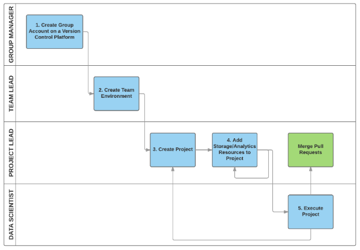

# Team Data Science Process Tutorial #

This set of tutorials provide instructions on how to set up **[Team Data Science Process](https://azure.microsoft.com/en-us/documentation/learning-paths/data-science-process/)** (TDSP) environment for different personnel in an enterprise. For an overview, please read the blog [Building Intelligent Applications Using the Team Data Science Process](https://blogs.technet.microsoft.com/machinelearning/2016/09/08/building-intelligent-applications-using-the-team-data-science-process/).

Here are the key components of TDSP:

* A repository for each project on a code hosting platform for versioning, information security, and collaboration.
* This project repository has a standardized directory structure with document templates that need to be filled in as the data science projects proceed. These document templates provide guidance for you to execute data science projects in a standardized manner. 
* Repositories of utilities for you to share useful utilities for your entire group, or your team. These utilities make the execution of each stages of data science project more efficient. 
* A work item management system for tracking tasks and to-do lists of your projects, and for scrum planning within the team or across teams.
* Shared storage/analytics resources on cloud or on premise to save on budget and to support collaboration within the data science organization or teams. 

Please choose the corresponding tutorial based on your role in your organization. 

## Definition of four different personnel
1. ***Group Manager***. Group Manager is defined as the manager of a data science unit in an enterprise. Such a data science unit might have multiple data science teams, each of which is working on multiple data science projects in a certain business vertical. It might also be possible that the data science unit only has a small number of data scientists and therefore does not have multiple teams. For such small data science unit, the Group Manager and the Team Lead might be just the same person. 

2. ***Team Lead***. A team lead is leading a team in the data science unit of an enterprise. A team consists of multiple data scientists. 

3. ***Project Lead***. A project lead is leading the daily activities of one or multiple individual data scientists on a specific data science project. 

4. ***Project Individual Contributor (Data Scientist)***. A project individual contributor is a data scientist who is actually executing the data science project. 

## Summarization of tasks to be completed by four personnel

The following picture depicts the roles of the four personnel in adopting TDSP from Microsoft, and their tasks in general. 

> You will notice that in the instructions for four personnel, we show steps of how to set up TDSP environment in Visual Studio Team Services (VSTS). VSTS integrates both work item management and code hosting service (versioning) together. We build the instructions based on VSTS because that is what we are using for TDSP at Microsoft. You have the freedom to choose other platforms for work item management and scrum planning, and for code hosting services. 

### Group Manager. The group lead, or his/her designated TDSP system administrator, will complete the following tasks in order to adopt TDSP:
- Create a group account on a code hosting platform (like GitHub, Git, Visual Studio Team Services, or others)
- Create a project template repository on the group account, and seed it from the project template repository developed by Microsoft TDSP team. The TDSP project template repository from Microsoft provides a standardized directory structure including directories for data, code, and documents, and provides a set of standardized document templates to guide an efficient data science process. 
- Create a utility repository, and seed it from the utility repository developed by Microsoft TDSP team. The TDSP utility repository from Microsoft provides a set of useful utilities to make the work of a data scientist more efficient, including utilities for interactive data exploration, analysis, and reporting, and baseline modeling and reporting.
- Set up the security control policy of these two repositories on your group account.  

Click [Group Lead](./1_Group_Manager.html) for detailed step-by-step instructions. 

### Team Lead. The team lead, or his/her designated team project administrator, will complete the following tasks in order to adopt TDSP:
- If VSTS is selected to be the code hosting platform for versioning and collaboration, create a team project on the group's VSTS server. Otherwise, this task can be skipped.
- Create the Team project template repository under the team project, and seed it from the group project template repository set up by your group manager or his delegates. 
- Create the Team utility repository, and add the team specific utilities to the repository. 
- (Optional) Create Azure file storage to be used to store data assets that can be useful for the entire team. 
- (Optional) Mount the Azure file storage to his/her Data Science Virtual Machine (DSVM), and add data assets on it.
- Set up the security control by adding team members and configure their preveliges. 

Click [Team Lead](./2_Team_Lead.html) for detailed step-by-step instructions. 

### Project Lead. The project lead will complete the following tasks in order to adopt TDSP:

- Create a project repository under the team project, and seed it from the Team project template repository. 
- (Optional) Create Azure file storage to be used to store data assets of the project. 
- (Optional) Mount the Azure file storage to his/her Data Science Virtual Machine (DSVM), and add project data assets on it.
- Set up the security control by adding project members and configure their preveliges. 

Click [Project Lead](./3_Project_Lead.html) for detailed step-by-step instructions. 

### Project Individual Contributor. The project ICs will complete the following tasks in order to conduct the data science project by following the team data science process from Microsoft. 

- Clone the project repository set up by the project lead. 
- (Optional) Mount the Azure file storage to his/her Data Science Virtual Machine (DSVM).
- Set up the security control by adding project members and configure their preveliges. 

Click [Project Individual Contributors](./4_Project_IC.html) for detailed step-by-step instructions. 

### Data Science Project Execution. 
By following this instruction, data scientists, project lead, and team lead can create work items to track all tasks and stages a project needs from beginning to end. Using git also ensures collaboration among data scientists, and that the artifacts generated from project execution are version controlled and shared by all project members.

The instruction for project execution is developed based on the assumption that both work items and project git repositories are on VSTS. This is what we do for TDSP at Microsoft. Using VSTS for both allows you to link your work items with Git branches of your project repository. In this way, you can easily track what has been done for a work item. 

If you choose two independent systems, one for work item tracking and scrum planning, and the other one for versioning, it might be not so easy to connect them naturally.  

Detailed step-by-step instructions include:

- Sprint planning
- Developing artifacts on git branches to address work items
- Code reviewing and merging branches with master branches

Click [Typical Data Science Project Execution](./project-execution.html) for detailed step-by-step instructions.