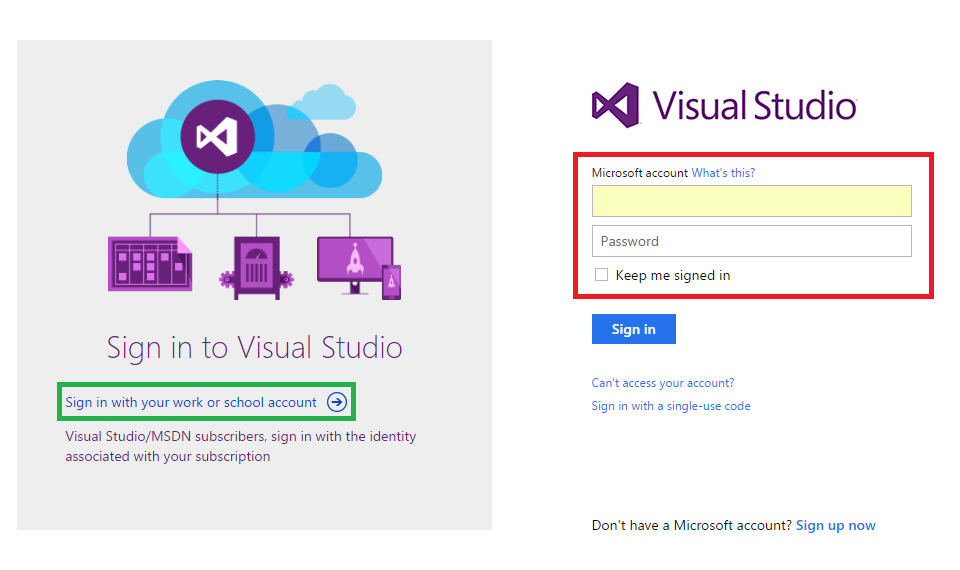
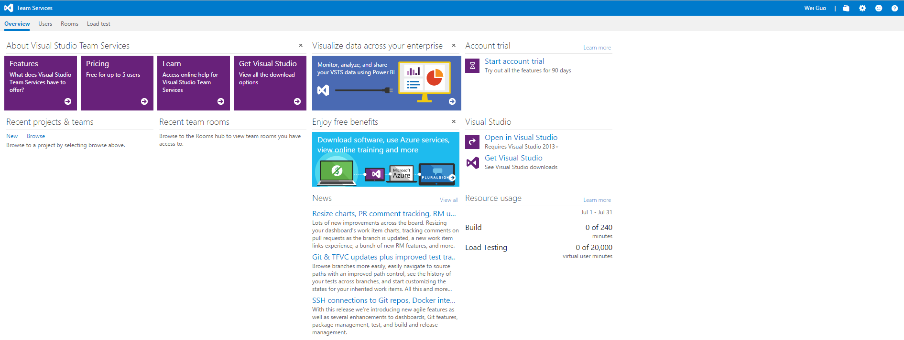
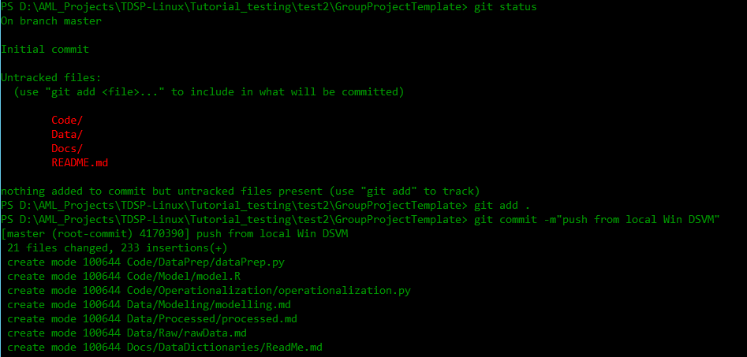

## Group Manager ##

The tasks of group managers to set up the TDSP environment for the entire group are depicted as follows. Tasks in block 2 is needed if you are using VSTS as the code hosting platform, and you want to organize the GroupUtilities and GroupProjectTemplate repositories under the GroupCommon team project so that they can be separated from the other repositories created by team leads and project leads of your organization. 


>While there are many options for the code hosting platform, we at Microsoft choose to use VSTS for TDSP. The following instructions are on how to complete the tasks on VSTS. If you choose to use some other platform, the tasks are generally the same, but there might be some minor differences on how to complete them. 

### Notations

- `R01`: The project template repository developed and managed by TDSP team of Microsoft.
- `R02`: The utilities repository developed and managed by TDSP team of Microsoft.
- `R1`: The GroupProjectTemplate repository on Git you are going to set up.
- `R2`: The GroupUtilities repository on Git you are going to set up.
- `D01` and `D02`: The local directories on your machine that you are going to clone R01 and R02 to, respectively.
- `D1` and `D2`: The local directories on your machine that you are going to clone R1 and R2 to, respectively.

### 1. Set up Visual Studio Team Services (VSTS) server and common repositories for your group ###

The VSTS server will be the server where all common repositories (e.g., the GroupProjectTemplate and GroupUtilities), all team repositories, and all project repositories will be hosted. The common repositories will be the ones that can be adopted by all teams and data science projects within your group.

> If you choose to use some other code hosting platform, you need to create an account on that platform for your entire group. 

- Sign up VSO server

	Go to [Visual Studio online](https://www.visualstudio.com/), click **sign in** in the upper right corner.

	
	
	Sign in with your Microsoft account. If you do not have a Microsoft account, click **Sign up now** to create a Microsoft account, and then sign in using this account. 

	If your organization has Visual Studio/MSDN subscription, click the link in the green box to sign in with your work or school account which has been added to this subscription. 
	
	
	
	After you sign in, click **Create New Account** in the upper right corner as in the following image.
	
	
	
	A window will be popped up asking you to fill in the information of the VSTS server you want to create. 

	- Fill in your **server name**. After this server is created, the URL of your server will be _https://<servername\>.visualstudio.com_. 
	- Make sure that you select **_Git_** to manage your code.
	- In field **Project name:", input _GroupCommon_. 
	- Choose _**Agile**_ as the value for **Organize work using:**.
	- Choose a geo location to **Host your projects in:**. In this example, we choose _South Central US_. 
	
	

	[Azure Note] If you see a popup window like the following after you click _Create new account_, you need to click _**Change details**_ to expand the popup window in order to see all fields. 

	

	After your VSTS server is created, you will be directed to the VSTS server at _https://<servername\>.visualstudio.com_.
						
	

- Rename the Default Repository of GroupCommon as GroupProjectTemplate (referred as R1 in this instruction)
	
	- On the main page of your VSTS server, click **Browse**. Then, in the popup window, under the server name (_mysamplegroup_ in this example), select **GroupCommon**. Click **Navigate** to go to the page of the team project _GroupCommon_. 
	
	

	
	
	- On the page of the team project _GroupCommon_, click **Collaborate on code**. You will be directed to the page of the default Git repository of team project **GroupCommon**. Currently, this Git repository is still empty. 

	
	
	- On the Git repository page of **GroupCommon**, click **GroupCommon** on the top left corner (the red box in the figure below), and select **Manage repositories...** (the green box in the figure below). You will be directed to the _Version Control_ tab of your team project **CONTROL PANEL**.

	

	- On the _Version Control_ tab, click the GroupCommon repository on the left panel, and select _Rename repository_. 
	
	
	
	- In the popup window, provide a new name _GroupProjectTemplate_, and click **Rename**. 
	
	
	
- Create GroupUtilities Repository under VSTS Server (referred as R2 in this instruction)
	
	On the _Version Control_ tab of the _CONTROL PANEL_ of your team project, click **New repository...**, then select _Git_ as the **Type**, and provide _GroupUtilities_ as the **Name**.

	 

	
			
	Now you can see there are two repositaries: GroupUtilities and GroupProjectTemplate under GroupCommon
	
	

### 2. Seed GroupProjectTemplate (R1) and GroupUtilities (R2) from TDSP Repositories ProjectTemplate (referred as R01) and Utilities (referred as R02) on GitHub  ###

In this step, you are going to seed your two repositories GroupProjectTemplate (R1) and GroupUtilities (R2) from the two repositories ProjectTemplate (R01) and Utilities (R02) managed by TDSP team from Microsoft. After this step, your R1 repository will have the same set of directories and document templates as in R01, and your R2 repository will have the set of data science utilities developed by Microsoft TDSP team.


-  **Prerequisite**: 
	- Git is installed on your machine. If you are using Data Science Virtual Machine, Git has been pre-installed and you are good to go. Otherwise, please refer to sections **Install Git on Windows and Linux machine** and **Provision Data Science Virtual Machine** in [Tools](./5_Tool.md).  
	- If you are using **Windows DSVM**, you need to have [Git Credential Manager (GCM)](https://github.com/Microsoft/Git-Credential-Manager-for-Windows) installed on your machine. On the _README.md_, scroll down to section **Download and Install**, and click the _latest installer_. You will be directed to the latest installer page. Download the .exe installer and run it. 
	- If you are using **Linux DSVM**, create SSH public key on your DSVM and add it to your group VSTS server. For details about SSH, please refer to **Create SSH public key** section in [Tools](./5_Tool.md).

- Clone TDSP ProjectTemplate repository (R01) and TDSP Utilities (R02) from TDSP VSTS server to folders in your local DSVM as D01 and D02

	- Create a directory as the root directory to host all your clones of the repositories. For instance, in Windows DSVM, create a directory `C:\GitRepos\DGADSCommon`. In Linux DSVM, create a directory `GitRepos\DGADSCommon` in your home directory. 

	- Open PowerShell (Windows) or bash commands (Linux). Change to the `GitRepos\DGADSCommon` directory, and run the following commands:
	

			git clone https://github.com/Azure/Azure-TDSP-ProjectTemplate
			git clone https://github.com/Azure/Azure-TDSP-Utilities

	

	
	
	- After the clones complete, you should be able to see two directories _ProjectTemplate_ and _Utilities_ under `GitRepos\DGADSCommon` directory. 

- Clone GroupProjectTemplate repository (R1) and GroupUtilities repository (R2) on local directories (referred as D1 and D2, respectively) under `GitRepos\GroupCommon` on your DSVM

	- Get the URLs of the repositories. Go to your GroupCommon home page (usually with URL https://<VSTS Server Name\>.visualstudio.com/GroupCommon). Click **CODE**. Choose the repository, either GroupProjectTemplate or GroupUtilities, and copy the _Clone URL_ (HTTPS for Windows or SSH for Linux, based on the operating system of the DSVM you are going to clone the repository to).  

	

	- In PowerShell script prompt (Windows) or Shell command (Linux), change directory to `GitRepos\GroupCommon`, run the following commands to clone R1 and R2 into `GitRepos\GroupCommon`.
	
	**Windows DSVM**

	```
	git clone <the HTTPS URL of the GroupProjectTemplate repository>
	git clone <the HTTPS URL of the GroupUtilities repository>
	```

	

	**Linux DSVM**
	```
	git clone <the SSH URL of the GroupProjectTemplate repository>
	git clone <the SSH URL of the GroupUtilities repository>
	```
	

	[Azure Notes] You will receive warning messages that D1 and D2 are empty. 
	
- Seed your GroupProjectTemplate and GroupUtilities Repositories from the TDSP Repositories (R01 and R02)

	Now in your local machine, we need to copy the content of ProjectTemplate and Utilities directories (except the metadata in .git directories) under _GitRepos\DGADSCommon_ to your GroupProjectTemplate and GroupUtilities directories under `GitRepos\GroupCommon`. Run the following scripts in PowerShell console (Windows) or Shell script console (Linux). The files in `GitRepos\DGADSCommon\ProjectTemplate` (D01) will be copied to `GitRepos\GroupCommon\GroupProjectTemplate` (D1), and the files in `GitRepos\DGADSCommon\Utilities` (D02) will be copied to `GitRepos\GroupCommon\Utilities` (D2). 

	You will be prompted to input the complete paths to D01, D1, D02, and D2. For example, if `R01` is cloned into _C:\GitRepos\DGADSCommon\Utilities_, you need to input _C:\GitRepos\DGADSCommon\Utilities_ as the complete path. The paths you input will be validated. If you input a directory that does not exist, you will be asked to input again. 

	**Windows DSVM**		
	```
	wget "https://raw.githubusercontent.com/Azure/Azure-MachineLearning-DataScience/master/Misc/TDSP/tdsp_local_copy_win.ps1" -outfile "tdsp_local_copy_win.ps1"
	.\tdsp_local_copy_win.ps1 1
	```		

	

	Now you can see that files in directories D01 and D02 (except files in the .git directory) are copied to D1 and D2, respectively.

	

	**Linux DSVM**
	```
	wget "https://raw.githubusercontent.com/Azure/Azure-MachineLearning-DataScience/master/Misc/TDSP/tdsp_local_copy_linux.sh"
	bash tdsp_local_copy_linux.sh 1
	```

	
	
	Now you see that the files in the two folders (except files in the .git directory) are copied to GroupProjectTemplate and GroupUtilities respectively.

	

- Customize contents in D1 and D2, if needed

	If you want to customize the contents in D1 and D2 to meet the specific needs of your group, now it is the time to do so. You can modify the template documents, change the directory structure, or add existing utilities your group has developed and are helpful for your entire group. 

- Add contents in D1 and D2 to R1 and R2 on group server

	Now, you need to add the contents in D1 and D2 to repositories R1 and R2. Here are the git bash commands you can run in both Windows PowerShell or Linux. 

	Enter the directory `GitRepos\GroupCommon\GroupProjectTemplate`, run the following commands.
	```
	git status
	git add .
	git commit -m"push from win DSVM"
	git push
	```
	

	You can see that in your group's VSO server, in the GroupProjectTemplate repository, the files are synced instantly.

	

	Changing directory to `GitRepos\GroupCommon\GroupUtilities`, run the same set of four commands as above.

	[Azure Note] If this is the first time you commit to a Git repository, you will be asked to provide your name and email address. Please use the same name and email address when you commit to these two repositories. Using the same name and email address will provide convenience when later on you build PowerBI dashboard to track your Git activities on multiple repositories. 

	

### 3. Add group members to group server ###

From your group VSO server's homepage, click the **gear icon** next to your user name in the upper right corner, then click **Security**, you may add members to your group with different permissions. More details please refer to **Security Control** section in [Tools](./5_Tools.md).

 