## Team Lead ##

The tasks of team leads to set up the TDSP environment for the team are depicted as follows. Tasks in blocks 1 and 2 are needed if you are using VSTS as the code hosting platform, and you want to have separate team project for your own team so that all repositories of your team can be created under this team project. 

>The following instructions are developed based on that VSTS is the code hosting platform, which is the one we choose for TDSP at Microsoft. If other code hosting platform is used for your group, the tasks that need to be completed by the team lead generally do not change. But the way to complete these tasks might be slightly different. 

###Notations

- `R1` : The Group ProjectTemplate repository on Git that you are going to adopt from for your team ProjectTemplate repository.
- `R3` : The TeamProjectTemplate repository on Git you are going to set up.
- `R4` : The TeamUtilities repository on Git you are going to setup.
- `D1` : The local directory on your machine that you are going to clone `R1` to.
- `D3` and `D4` : The local directories on your machine that you are going to clone `R3` and `R4` to, respectively.

> For small data science group that might not have multiple data science teams, or even larger data science group with multiple data science teams but wants to get convenience on inter-team collaboration such as group-level sprint planning, the entire group can choose to create a single team project, and all projects from all data science teams each has a single repository under this single team project. If this fits your needs better than each data science team having an individual team project, your entire data science group can designate a git administrator to follow this instruction to create a single team project. 

> If some teams would like to have team-specific project templates, or team-specific utilities, under the single team project, the team leads or delegates should create team project template repositories and/or team utilities repositories under the same team project. You can name these repositories as _<TeamName\>ProjectTemplate_ and _<TeamName\>Utilities_, for instance, _TeamJohnProjectTemplate_ and _TeamJohnUtilities_. Then, the team leads need to let their team members know which template and utilities repositories to adopt when they are setting up and cloning the project and utilities repositories.

> Then, all project leads should follow the [project lead instructions](./3_Project_Lead.html) to create project  repositories under this single team project. 

### 1. Prerequisites: ###

- Your group VSTS server, or group account on some other code hosting platform has been set up by your group manager.
- GroupProjectTemplate repository (R1) has been set up on your group account of the code hosting platform by your group manager
- You have been authorized on your group account to create repositories for your team.

If any of these two privileges has not been completed, please reach out to your group manager or his/her delegate to set it up by following the [instructions](./1_Group_Manager.html).

- Git is installed on your machine. If you are using Data Science Virtual Machine, Git has been pre-installed and you are good to go. Otherwise, please refer to sections **Install Git on Windows and Linux machine** and **Provision Data Science Virtual Machine** in [Tools](./5_Tool.md).  
- If you are using **Windows machine**, you need to have [Git Credential Manager (GCM)](https://github.com/Microsoft/Git-Credential-Manager-for-Windows) installed on your machine. On the _README.md_, scroll down to section **Download and Install**, and click the _latest installer_. You will be directed to the latest installer page. Download the .exe installer and run it. 
- If you are using **Linux machine**, create SSH public key on your DSVM and add it to your group VSTS server. For details about SSH, please refer to **Generate Public SSH Key on Linux (CentOS) Machines** section in [Tools](./5_Resources.html).
	
### 2. Create team project on your group VSTS server ###

> Execute this step if you are using VSTS as your code hosting platform. 

- Go to your group's VSTS server homepage at URL https://<VSTS Server Name\>.visualstudio.com. 
- Click **New** to create a team project. A popup window will show asking you to input the Project name (_MyTeam_ in this example). Make sure that you select _Agile_ as the **Process template**, and _Git_ as the **Version control**. Click **Create project**. Your team project _MyTeam_ will be created in less than 1 minute. 

- After the team project _MyTeam_ is created, click **Nagivate to project** button, you will be directed to the home page of your team project. If you see a _Congratulations!_ popup window, click the button **Add code** (in red box). Otherwise, click **Code** (in yellow box). You will be directed to the Git repository page of your team project. 

On the Git repository page of your team project, click the downward arrow beside repository name _MyTeam_, and select _Manage repositories..._. 

On the **Version control** tab of the control panel of your team project, click _MyTeam_, then select _Rename repository..._. Input a new name to the repository, in this example, _MyTeamProjectTemplate_. You can choose something like _<Your team name\>ProjectTemplate_. Click **Rename** to continue.

- Create a new repository _<your team name\>Utilities_ under your team project. 
Click **New repository...** on the **Version control** tab of your team project's control panel. In the popup window, provide a name for this repository. In this example, we name it as _MyTeamUtilities_. You can choose something like _<your team name\>Utilities_. Make sure that you select _Git_ for **Type**. Then, click **Create** to continue. 

Now you should be able to see two repositories created under your team project _MyTeam_.

### 3. Seed your team ProjectTemplate repository (R3) from your GroupProjectTemplate (R1) ###
In this step, you initiate your team ProjectTemplate repository (R3) from your GroupProjectTemplate (R1). If you want to customize your ProjectTemplate repository to meet your specific needs, this is the time for you to customize it.

- Create directories _C:\GitRepos\GroupCommon_ and _C:\GitRepos\MyTeam_ on your machine (Windows), or _GitRepos\GroupCommon_ and _GitRepos\MyTeam_ on your home directory (Linux). Change to directory _GitRepos\GroupCommon_.
- Run the following commands based on the operating system of your machine. These commands will clone your _GroupProjectTemplate_ (R1) repository on your group VSTS server to local directory in _GitRepos\GroupCommon_ on your local machine. After cloning, directory _GroupProjectTemplate_ (referred as D1) will be created in directory _GitRepos\GroupCommon_. Here, we assume that your group manager created a team project GroupCommon, and the GroupProjectTemplate repository is under this team project. 

**Windows**

	git clone https://<Your VSTS Server name>.visualstudio.com/GroupCommon/_git/GroupProjectTemplate
	

**Linux**
	
	git clone ssh://<Your VSTS Server name>@<Your VSTS Server name>.visualstudio.com:22/GroupCommon/_git/GroupProjectTemplate
	
	

- Change to directory _GitRepos\MyTeam_
- Run the following commands based on the operating system of your machine. These commands will clone your _MyTeamProjectTemplate_ (R3) and _MyTeamUtilities_ repositories (R4) under your team project _MyTeam_ on your group VSTS server to local directories in _GitRepos\MyTeam_ on your local machine. After cloning, two directories _MyTeamProjectTemplate_ (referred as D3) and _MyTeamUtilities_ (referred as D4) will be created in directory _GitRepos\MyTeam_. Here, we assume that you named your team project template and utilities repositories as _MyTeamProjectTemplate_ and _MyTeamUtilities_. 

**Windows**

	git clone https://<Your VSTS Server name>.visualstudio.com/<Your Team Name>/_git/MyTeamProjectTemplate
	git clone https://<Your VSTS Server name>.visualstudio.com/<Your Team Name>/_git/MyTeamUtilities

		
**Linux**
	
	git clone ssh://<Your VSTS Server name>@<Your VSTS Server name>.visualstudio.com:22/<Your Team Name>/_git/MyTeamProjectTemplate
	git clone ssh://<Your VSTS Server name>@<Your VSTS Server name>.visualstudio.com:22/<Your Team Name>/_git/MyTeamUtilities
	

- Copy contents in D1 to D3, except the metadata in directory _.git_. 

Run the following shell scripts in PowerShell commandline (Windows), or Linux shell, depending on the operating system. You will be prompted to provide the paths to the source directory D1 and to the destination directory D3. 

**Windows**		
	
  	wget "https://raw.githubusercontent.com/Azure/Azure-MachineLearning-DataScience/master/Misc/TDSP/tdsp_local_copy_win.ps1" -outfile "tdsp_local_copy_win.ps1"
	.\tdsp_local_copy_win.ps1 2
	

**Linux DSVM**
	
	wget "https://raw.githubusercontent.com/Azure/Azure-MachineLearning-DataScience/master/Misc/TDSP/tdsp_local_copy_linux.sh"
	bash tdsp_local_copy_linux.sh 2
    
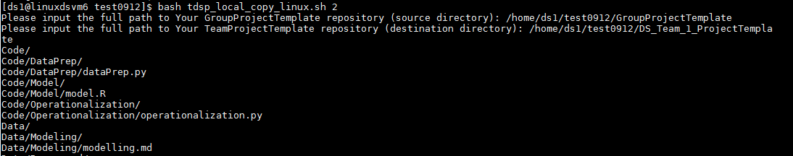
		
- Customize your _MyTeamProjectTemplate_ (D3) and _MyTeamUtilities_ (D4), if needed.

If you want to customize the contents in D3 to meet the specific needs of your team, now it is the time to do so. You can modify the template documents, or change the directory structure.

If your team has developed some utilities that you want to share with your entire team, copy and paste these utilities into directory D4. 

- Add contents in D3 and D4 to R3 and R4

Now, you need to add the contents in D3 and D4 to repositories R3 and R4. Here are the git bash commands you can run in both Windows PowerShell or Linux. 

Enter the directory _GitRepos\MyTeam\MyTeamProjectTemplate_, run the following commands.
	
	git status
	git add .
	git commit -m"push from DSVM"
	git push
	

You can see that in your group's VSO server, in the MyTeamProjectTemplate repository, the files are synced instantly.

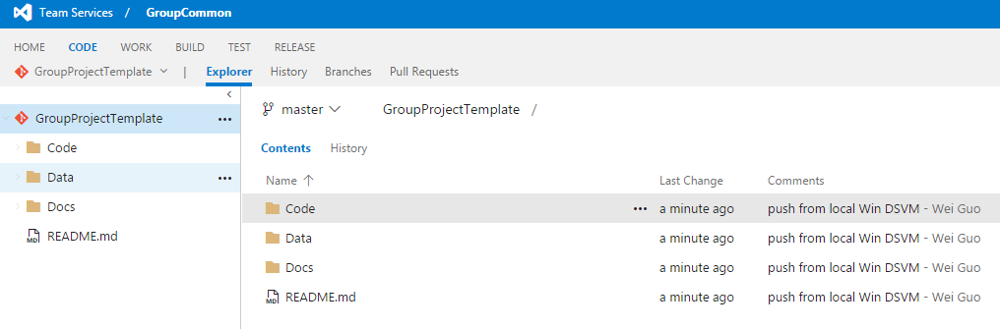

Changing directory to _GitRepos\MyTeam\MyTeamUtilities_, run the same set of four git commands.

> If this is the first time you commit to a Git repository, you need to configure global parameters _user.name_ and _user.email_ before you run the _git commit_ command. Run the following two commands:
		
	git config --global user.name <your name>
	git config --global user.email <your email address>
 
>  If you are committing to multiple Git repositories, please use the same name and email address when you commit to these them. Using the same name and email address will provide convenience when later on you build PowerBI dashboards to track your Git activities on multiple repositories.

### 4. Create team data and analytics resources (Optional) ###

You might want to create some data and/or analytics resources to share with your entire team so that they can execute the projects on the shared resources, save on budgets, and get efficiency. In this section, we just provide instructions on how to create and mount Azure file storage. For other resources like Azure Data Science Virtual Machines, Azure HDInsight Spark Clusters, etc, please refer to [**Azure Data and Analytics Resources**](./5_Resources.html), which provides you some guidance from data science perspective on selecting the right resources for your needs, and links to product pages and some useful tutorials we have published.

> ***Requirements on creating and mounting Azure file storage***. In order to avoid data transmitting cross data centers, which might be slow and costly, the resource group, storage account, and the Azure VM (e.g., DSVM) have to be in the same Azure data center. 

Run the following scripts to create Azure file storage for your team. Azure file storage for your team can be used to store data assets that can be useful for your entire team. 

When you run the shell scripts, you will be prompted to type in your Azure account and Azure subscription information. 

**Windows**

	wget "https://raw.githubusercontent.com/Azure/Azure-MachineLearning-DataScience/master/Misc/TDSP/CreateFileShare.ps1" -outfile "CreateFileShare.ps1"
	.\CreateFileShare.ps1

	

Log in to your Microsoft Azure account when prompted:

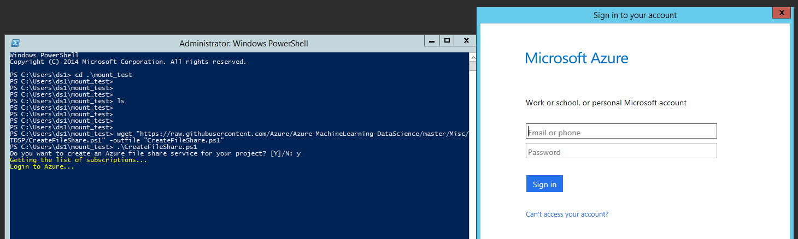

Select the Azure subscription you want to use:

Under your selected subscription, you can select which storage account to use or create a new one:

Enter the name of the Azure file storage to create, only lower case characters, numbers and - are accepted:

After the file service is created, you can save the Azure file storage information for later use when you mount it to your Azure virtual machines:

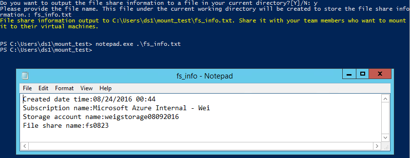

**Linux**

	wget "https://raw.githubusercontent.com/Azure/Azure-MachineLearning-DataScience/master/Misc/TDSP/CreateFileShare.sh"
	bash CreateFileShare.sh

Log in to your Microsoft Azure account following the instructions on screen:

Select the Azure subscription you want to use:

Under your selected subscription, you can select which storage account to use or create a new one:

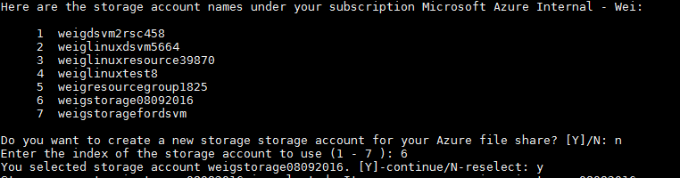

Enter the name of the Azure file storage to create, only lower case characters, numbers and - are accepted:

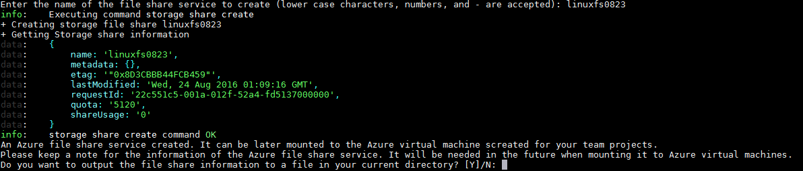

After the file service is created, you can save the Azure file storage information for later use when you mount it to Azure Virtual machines:

### 5. Mount Azure file storage (Optional) ###

After Azure file storage is created succesfully, it can be mounted to your local machine using the following scripts.

**Windows**

	wget "https://raw.githubusercontent.com/Azure/Azure-MachineLearning-DataScience/master/Misc/TDSP/AttachFileShare.ps1" -outfile "AttachFileShare.ps1"
	.\AttachFileShare.ps1
	
> You will be asked to log in first, if you have not logged in.

You will be asked if you have an Azure file storage information file. If you have such file, click **Enter** or **y** to continue, and input the ***complete path and name** of the file you create in previous step. Then, the needed information to mount an Azure file storage will be directly read from that file, and you are ready to go to the next step.

Then you will be asked to enter the name of the drive to be added to your virtual machine. A list of existing drive names is printed on the screen. You should provide a drive name that does not exist in the list.

You will find that a new drive (F drive) is successfully mounted to your machine.

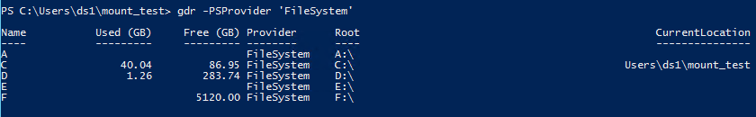

> If you do not have your Azure file storage information on a text file to use, you can follow the instructions on screen to to type in required subscription, storage account, and Azure file storage information to attach the Azure file storage to your machine:

>You need to type in your Azure subscription name, select storage account where the Azure file storage is created and type in the Azure file storage name:

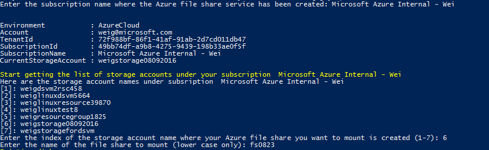

**Linux**

	wget "https://raw.githubusercontent.com/Azure/Azure-MachineLearning-DataScience/master/Misc/TDSP/AttachFileShare.sh"
	bash AttachFileShare.sh

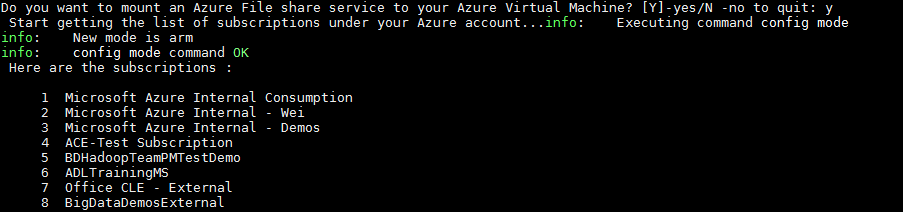

> You will be asked to log in first, if you have not logged in.

If you have a file containing the Azure file storage information, click **Enter** or **y** to continue, and input the ***complete path and name** of the file you create in previous step. Then, the needed information to mount an Azure file storage will be directly read from that file, and you are ready to go to the next step.

Then you will be asked to enter the name of the drive to be added to your virtual machine. A list of existing drive names is printed on the screen. You should provide a drive name that does not exist in the list.

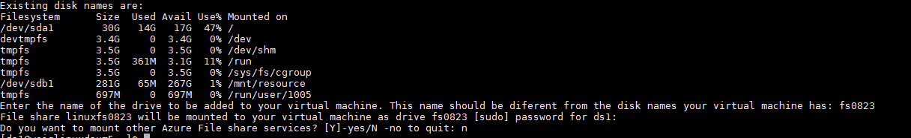

You will find that a new drive (mounted on fs0823) is successfully mounted to your machine.

> If you do not have a file containing the Azure file storage information, below are the steps to input the information from keyboard:

> Input **n**.
> 
> Select the index of the subscription name where the Azure file storage is created in your previous step:

> Select the storage account under your subscription and type in the Azure file storage name:

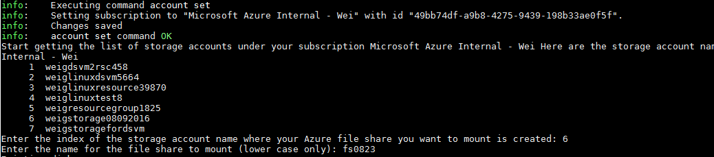

> Enter the name of drive to be added to your machine, which should be different from the existing ones:

### 6. Set up security control policy ###

From your team VSTS server's homepage, click the **gear icon** next to your user name in the upper right corner, then click **Security**, you may add members to your team with different permissions. More details please refer to **Security Control** section in [Tools](./5_Tools.html).

