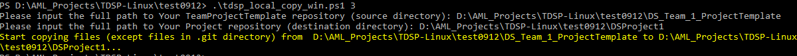
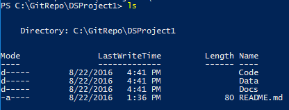
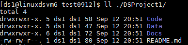

## Project Lead ##

The tasks of project leads to set up the TDSP environment for the project are depicted as follows. 

>The following instructions are developed based on that VSTS is the code hosting platform. If other code hosting platform is used for your group, the tasks that need to be completed by the team lead general do not change. But the way to complete these tasks might be slightly different. 

### Notations

-	`R3`: The TeamProjectTemplate repository on Git that your team lead has set up.
-	`R4`: The TeamUtilities repository on Git that your team lead has setup.
-	`R5`: The Project repository on Git you are going to setup for your project.
-	`D3`, `D4`, and `D5`: The local directories on your machine that you are going to clone `R3`, `R4`, and `R5` to, respectively.

### 1. Prerequisites: ###

- Your team lead has set up the team project and two repositories _TeamProjectTemplate_ (`R3`) and _TeamUtilities_ (`R4`).
- You have been added to your team project with the privilege to create project repositories.

If any of these two steps has not been completed, please reach out to your team lead or his/her delegate to set it up by following the [instructions](./2_Team_Lead.html).

- Git is installed on your machine. If you are using Data Science Virtual Machine, Git has been pre-installed and you are good to go. Otherwise, please refer to sections **Install Git on Windows and Linux machine** and **Provision Data Science Virtual Machine** in [Tools](./5_Resources.html).  
- If you are using **Windows machine**, you need to have [Git Credential Manager (GCM)](https://github.com/Microsoft/Git-Credential-Manager-for-Windows) installed on your machine. On the _README.md_, scroll down to section **Download and Install**, and click the _latest installer_. You will be directed to the latest installer page. Download the .exe installer and run it. 
- If you are using **Linux machine**, create SSH public key on your DSVM and add it to your group VSTS server. For details about SSH, please refer to **Create SSH public key** section in [Tools](./6_Tools.html).

### 2. Create project repository (`R5`) under Team project _MyTeam_ ###

- Assuming that you have logged in to your group VSTS server at _https://<VSTS Server Name\>.visualstudio.com_. Under **Recent projects & teams**, click **Browse**. A window will be popped up which lists all team projects on the VSTS server. 

	

- Click the team project name that you are going to create your project repository in. In this example, click **MyTeam**. Then, click **Navigate**. You will be directed to the home page of the team project **MyTeam**.

	

- Click _**Collaborate on code**_, you will be directed to the git home page of your team project. Click the downward arrow at the top left corner, and select _**+ New repository**_. Then, in the popup window, input a name for your project git repository. Make sure that you select _**Git**_ as the type of the repository. In this example, we use the name _DSProject1_. Then, click _**Create**_. Your project git repository will be created. 

### 3. Seed DSProject1 repository (R5) from your team project template repository (R3) ###

- Clone your team project template repository (R3) to a directory (D3) on your local machine.

On your local machine, create a directory _C:\GitRepos\MyTeamCommon_ (Windows), or _$home/GitRepos/MyTeamCommon_ (Linux), and change to that directory. Then, run the following command to clone your team project template repository to your local machine. 

**Windows**
			
	git clone <the HTTPS URL of the TeamProjectTemplate repository>
	
Typically, the _HTTPS URL of your team project template repository_ is _https://<VSTS Server Name\>.visualstudio.com/<Your team project name\>/\_git/<Your team project template repository name\>_. In this example, we have _https://mysamplegroup.visualstudio.com/MyTeam/\_git/MyTeamProjectTemplate_. 

			
**Linux**

	git clone <the SSH URL of the TeamProjectTemplate repository>
		

Typically, the _SSH URL of the team project template repository_ is _ssh://<VSTS Server Name\>@<VSTS Server Name\>.visualstudio.com:22/<Your Team Project Name>/\_git/<Your team project template repository name\>. In this example, we have _ssh://mysamplegroup@mysamplegroup.visualstudio.com:22/MyTeam/\_git/MyTeamProjectTemplate_. 

- Clone DSProject1 repository (R5) to a directory (D5) on your local machine

Change directory to _GitRepos_, and run the following command to clone your project repository to your local machine. 

**Windows**
			
	git clone <the HTTPS URL of the Project repository>

**Linux**

	git clone <the SSH URL of the Project repository>

Typically, the _SSH URL of the project repository_ is _ssh://<VSTS Server Name\>@<VSTS Server Name\>.visualstudio.com:22/<Your Team Project Name>/\_git/<Your project repository name\>. In this example, we have _ssh://mysamplegroup@mysamplegroup.visualstudio.com:22/MyTeam/\_git/DSProject1_.

- Copy contents in D3 to D5 

Now in your local machine, you need to copy the content of _D3_ to _D5_, except the git metadata in .git directory. The following scripts will do the job. Make sure to type in the correct paths to the directories. Source folder is the one from your team (_D3_); destination folder is the one for your project (_D5_).	

**Windows**
	
	wget "https://raw.githubusercontent.com/Azure/Azure-MachineLearning-DataScience/master/Misc/TDSP/tdsp_local_copy_win.ps1" -outfile "tdsp_local_copy_win.ps1"
	.\tdsp_local_copy_win.ps1 3
	

Now you can see in _DSProject1_ folder, all the files (excluding the .git) are copied from _MyTeamProjectTemplate_.

**Linux**
			
	wget "https://raw.githubusercontent.com/Azure/Azure-MachineLearning-DataScience/master/Misc/TDSP/tdsp_local_copy_linux.sh"
	bash tdsp_local_copy_linux.sh 3
		

Now you can see in _DSProject1_ folder, all the files (except the metadata in .git) are copied from _MyTeamProjectTemplate_.

- Make changes to D5 if needed
If your project needs some specific directories or documents, other than the ones you get from your team project template (copied to your D5 directory in the previous step), you can customize the content of D5 now. 

- Add contents in D5 to R5 on your group VSTS server

You now need to push contents in **_DSProject1_** to _R5_ repository in your team project on your group's VSTS server. Change to directory _D5_, and use the following git commands to add contents in _D5_ to _R5_, commit the change, and push. The commands are the same for both Windows and Linux systems. 
	
	git status
	git add .
	git commit -m"push from win DSVM"
	git push
		
[Azure Note] If this is the first time you commit to a Git repository, you will be asked to provide your name and email address. Please use the same name and email address when you commit to these two repositories. Using the same name and email address will provide convenience when later on you build PowerBI dashboard to track your Git activities on multiple repositories.

### 4. Create and mount Azure file storage as project resources (Optional) ###

If you want to create Azure file storage to share data, such as the project raw data and the features generated for your project, so that all project members have access to the same datasets from multiple DSVMs, follow the detailed instructions in sections 4 and 5 of [2\_Team\_Lead.html](./2_Team_Lead.html).