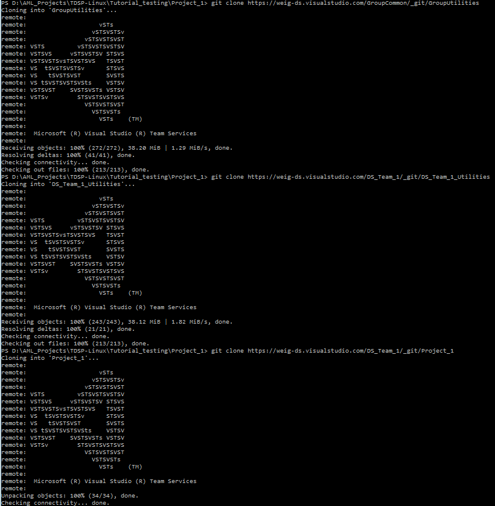
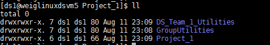

## Project Individual Contributors (Data Scientists)##

The tasks of project individual contributors (data scientists) to set up the TDSP environment for the project are depicted as follows. 

GroupUtilities is the repository that your group is maintaining to share useful utilities across the entire group. TeamUtilities is the repository that your team is maintaining specifically for your team. 

For how to execute a data science project under TDSP, please refer to [Typical Data Science Project Execution](./Project_Execution.html). 

>The following instructions are developed based on that VSTS is the code hosting platform, which is the one we choose for TDSP at Microsoft. If other code hosting platform is used for your group, the tasks that need to be completed by the project individual contributors generally do not change. But the way to complete these tasks might be slightly different. 

### Notations

- `R2`: The GroupUtilities repository on Git that your group manager has set up.
- `R4`: The TeamUtilities repository on Git that your team lead has set up.
- `R5`: The Project repository on Git that has been set up by your project lead and you are going to clone from.
- `D2`, `D4`, and `D5`: The local directories on your machine that you clone `R2`, `R4`, and `R5` to, respectively.

### 1. Prerequisites

- Your group manager has set up the _GroupUtilities_ repository (if any). 
- Your team lead has set up the _TeamUtilities_ repository (if any).
- Your project lead has set up the project repository. 
- You have been added to your project repository by your project lead with the privilege to clone from and push back to the project repository.

The second prerequisite (the _TeamUtilities_ repository) is optional, depending on whether your team has team-specific utility repository. If any of other three prerequisites has not been completed, please reach out to your team lead, your project lead, or their delegates to set it up by following the instructions for [team lead](./2_Team_Lead.html), or for [project lead](./3_Project_Lead.html).

- Git is installed on your machine. If you are using Data Science Virtual Machine, Git has been pre-installed and you are good to go. Otherwise, please refer to sections **Install Git on Windows and Linux machine** and **Provision Data Science Virtual Machine** in [Tools](./5_Resources.html).  
- If you are using **Windows machine**, you need to have [Git Credential Manager (GCM)](https://github.com/Microsoft/Git-Credential-Manager-for-Windows) installed on your machine. On the _README.md_, scroll down to section **Download and Install**, and click the _latest installer_. You will be directed to the latest installer page. Download the .exe installer and run it. 
- If you are using **Linux machine**, create SSH public key on your DSVM and add it to your group VSTS server. For details about SSH, please refer to **Create SSH public key** section in [Tools](./5_Resources.html).
- If your team and/or project lead has created some Azure file storage that you need to mount to your DSVM, you should get the Azure file storage information from them. 

### 2. Clone GroupUtilities repository (R2), TeamUtilities repository (R4), and Project repository (R5) to local machine as D2, D4, and D5.

On your local machine, create a directory _C:\GitRepos_ (Windows), or _$home/GitRepos_ (Linux), and change to that directory. Then, run the following commands to clone your _GroupUtilities_, _TeamUtilities_, and _Project_ project repositories to your local machine. 

**Windows**
	
	git clone <the URL of the GroupUtilities repository>
	git clone <the URL of the TeamUtilities repository>
	git clone <the URL of the Project repository>
	

You will see the three folders under your project directory.

**Linux**
	
	git clone <the SSH URL of the GroupUtilities repository>
	git clone <the SSH URL of the TeamUtilities repository>
	git clone <the SSH URL of the Project repository>

You will see the three folders under your project directory.

### 3. Mount Azure file storage to your DSVM (Optional)

To mount Azure file storage to your DSVM, please follow the instructions in Section 5 of the [Team Lead Instructions](./2\_Team\_Lead.html).

