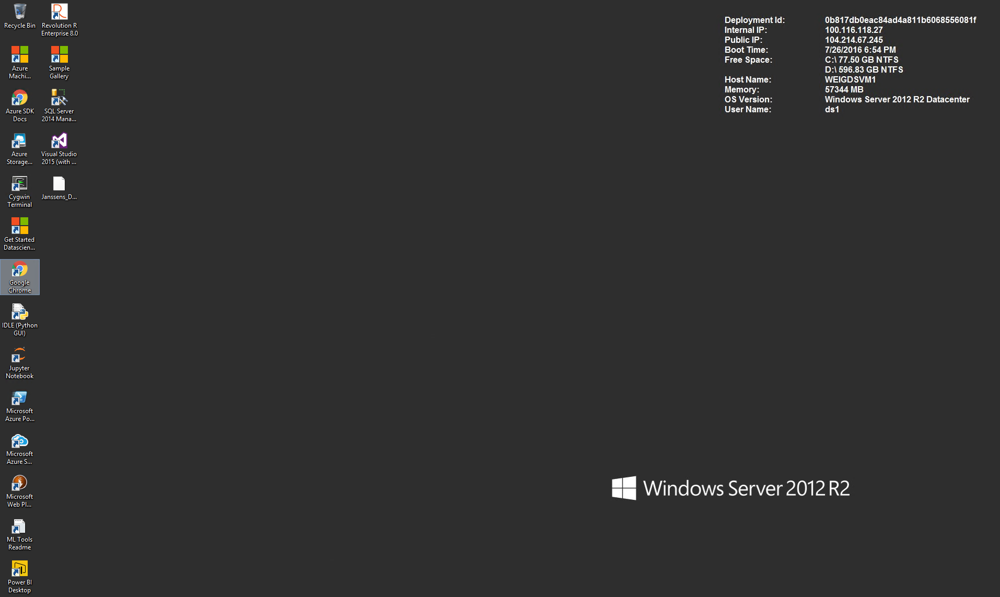
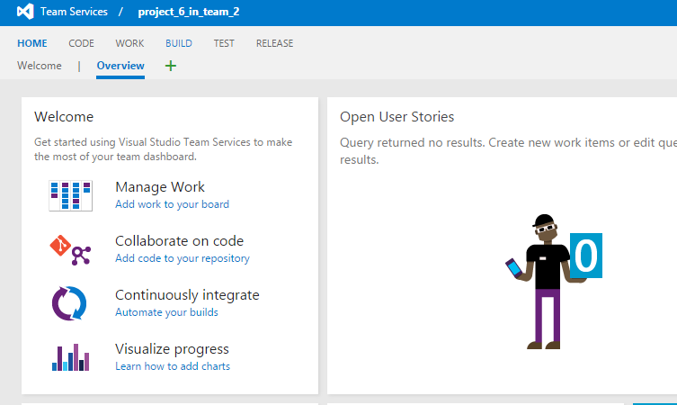
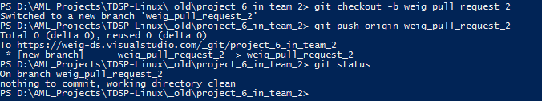
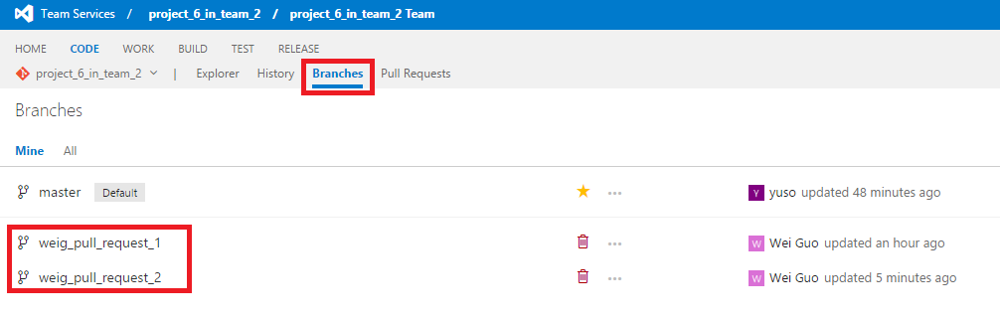
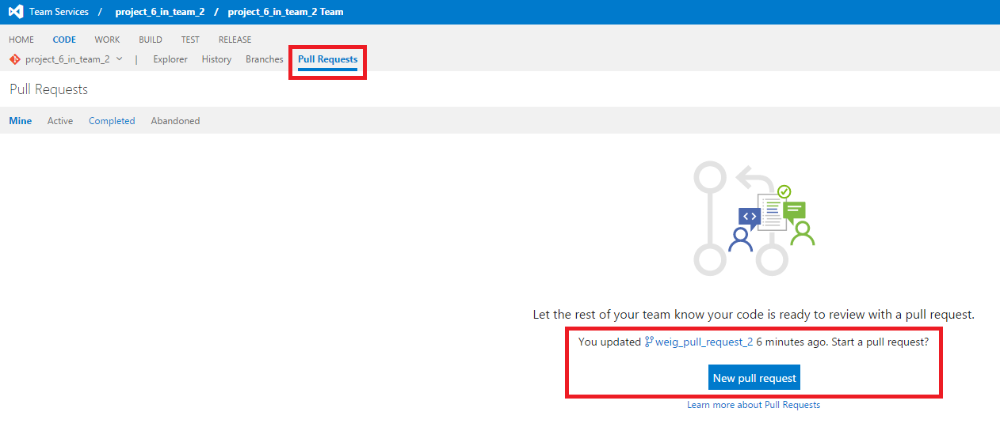

## Resources ##

Microsoft provides a full spectrum of data and analytics resources, on cloud or on premise, to make your execution of data science projects scalable and efficient. These data and analytics resources include:


- Data Science Virtual Machines (both Windows and CentOS Linux)
- HDInsight Spark Clusters
- SQL Data Warehouse
- Azure Data Lake
- HDInsight Hive Clusters
- Azure File Storage
- SQL Server 2016 R Services. 

Please choose the data and analysis resources based on the needs of your projects. The following table provides a brief guidance. If you want to learn how to use the different data and analytics platforms, please click the links provided at the bottom row of the table. You will be directed to the end to end walkthrough page of the platform. 

<table>
    <tr>
        <th></th>
		<th>DSVM</th>
        <th>HDInsight Spark Cluster</th>
        <th>SQL Data Warehouse</th>
        <th>Azure Data Lake</th>
        <th>HDInsight Hive (Hadoop) Clusters</th>
        <th>SQL Server 2016 R Services</th>
    </tr>
    <tr>
        <th>Structured Data</th>
        <th>Y</th>
        <th>Y</th>
        <th>Y</th>
        <th>Y</th>
        <th>Y</th>
        <th>Y</th>
    </tr>
    <tr>
        <th>Semi-Structured Data</th>
        <th>Y</th>
        <th>Y</th>
        <th>N</th>
        <th>Y</th>
        <th>N</th>
        <th>N</th>
    </tr>
    <tr>
        <th>Unstructured Data</th>
        <th>Y</th>
        <th>Y</th>
        <th>N</th>
        <th>Y</th>
        <th>N</th>
        <th>N</th>
    </tr>
    <tr>
        <th>Scalable</th>
        <th>N</th>
        <th>Y</th>
        <th>Y</th>
        <th>Y</th>
        <th>Y</th>
        <th>Y</th>
    </tr>
    <tr>
        <th>Elastic</th>
        <th>N</th>
        <th>Y</th>
        <th>Y</th>
        <th>Y</th>
        <th>N</th>
        <th>N</th>
    </tr>
    <tr>
        <th>Machine Learning Embedded</th>
        <th>Y</th>
        <th>Y</th>
        <th>N</th>
        <th>N</th>
        <th>N</th>
        <th>Y</th>
    </tr>
    <tr>
        <th>Supported Data Science Languages</th>
        <th>Python,R</th>
        <th>Python, R, Scala</th>
        <th>SQL</th>
        <th>U-SQL Queries</th>
        <th>Hive Queries, Python</th>
        <th>SQL, R</th>
    </tr>
    <tr>
        <th>End to End Data Science Walkthrough</th>
        <th><a href="https://azure.microsoft.com/en-us/documentation/articles/machine-learning-data-science-vm-do-ten-things/">Windows</a>, <a href="https://azure.microsoft.com/en-us/documentation/articles/machine-learning-data-science-linux-dsvm-intro/">Linux</a></th>
        <th><a href="https://azure.microsoft.com/en-us/documentation/articles/machine-learning-data-science-spark-overview/">Python</a>,<a href="https://azure.microsoft.com/en-us/documentation/articles/machine-learning-data-science-process-scala-walkthrough/">Scala</a></th>
        <th><a href="https://azure.microsoft.com/en-us/documentation/articles/machine-learning-data-science-process-sqldw-walkthrough/">SQL</a></th>
        <th><a href="https://azure.microsoft.com/en-us/documentation/articles/machine-learning-data-science-process-data-lake-walkthrough/">U-SQL Queries</a></th>
        <th><a href="https://azure.microsoft.com/en-us/documentation/articles/machine-learning-data-science-process-hive-walkthrough/">NYC Taxi Data</a>, <a href="https://azure.microsoft.com/en-us/documentation/articles/machine-learning-data-science-process-hive-criteo-walkthrough/">1TB Criteo Data</a></th>
        <th><a href="https://msdn.microsoft.com/en-us/library/mt683480.aspx">SQL Developers</a>, <a href="https://msdn.microsoft.com/library/mt612857.aspx">R Programmers</a></th>
    </tr>
</table>

In this document, we briefly describe these resources. We list these resources because either data scientists are most familiar with, or will have the sharpest learning curve to learn and start using them. More details can be found at the product pages of these resources. 

In the Appendix, we also provide instructions on how to install necessary git tools on your machine so that you can communicate with the git repository on your group server in VSTS. 

### Data Science Virtual Machine (DSVM)

The data science virtual machine contains popular tools for data science modeling and development activities. The main tools include Microsoft R Server Developer Edition, Anaconda Python distribution, Jupyter notebooks for Python and R, Visual Studio Community Edition with Python and R Tools, Power BI desktop, SQL Server Express edition. It also includes ML tools like CNTK (an Open Source Deep Learning toolkit from Microsoft), xgboost and Vowpal Wabbit.

Currently DSVM in Windows and CentOS Linux operating systems are available. You need to choose the size of the virtual machine (number of CPU cores and size of memories) based on the needs of the data science projects that you are planning to execute on the DSVM. For more details of DSVM, please refer to [Microsoft Azure Data Science Virtual Machine](https://azure.microsoft.com/en-us/marketplace/partners/microsoft-ads/standard-data-science-vm/). 

To know how to execute data science projects on the DSVM efficiently, please read [Ten things you can do on the Data science Virtual Machine.](https://azure.microsoft.com/en-us/documentation/articles/machine-learning-data-science-vm-do-ten-things/)

### Azure HDInsight Spark Clusters

Apache Spark is an open-source parallel processing framework that supports in-memory processing to boost the performance of big-data analytic applications. Spark processing engine is built for speed, ease of use, and sophisticated analytics. Spark's in-memory computation capabilities make it a good choice for iterative algorithms in machine learning and graph computations. Spark is also compatible with Azure Blob storage (WASB) so your existing data stored in Azure can easily be processed via Spark.

When you create a Spark cluster in HDInsight, you create Azure compute resources with Spark installed and configured. It only takes about ten minutes to create a Spark cluster in HDInsight. The data to be processed is stored in Azure Blob storage. See Use Azure Blob Storage with HDInsight.

TDSP team from Microsoft has published two end to end walkthroughs on how to use Azure HDInsight Spark Clusters to build data science solutions, in Python and Scala. More details of Azure HDInsight Spark Clusters can be found [here](https://azure.microsoft.com/en-us/documentation/articles/hdinsight-apache-spark-overview/). To learn and practice on how to build your data science solutions in Azure HDInsight Spark Clusters, please read [Data Science using **Python** with Spark on Azure](https://azure.microsoft.com/en-us/documentation/articles/machine-learning-data-science-spark-overview/), and [Data Science using **Scala** with Spark on Azure](https://azure.microsoft.com/en-us/documentation/articles/machine-learning-data-science-process-scala-walkthrough/). 

###  SQL Data Warehouse
Azure SQL Data Warehouse allows you to easily scale compute in seconds without over-provisioning or over-paying. Plus, SQL Data Warehouse offers the unique option to pause compute, giving you even more freedom to better manage your cloud costs. Now bring all your data with no tradeoffs on which data to ingest—run compute only on the datasets that matter.

More details of Azure SQL Data Warehouse can be found [here](https://azure.microsoft.com/en-us/services/sql-data-warehouse/). To learn and practice on how to build end to end advanced analytics solutions on SQL Data Warehouse, please follow the [The Team Data Science Process in action: using SQL Data Warehouse](https://azure.microsoft.com/en-us/documentation/articles/machine-learning-data-science-process-sqldw-walkthrough/)

### Azure Data Lake
Azure data lake is as an enterprise wide repository of every type of data collected in a single place prior to any formal definition of requirements or schema. This allows every type of data to be kept without discrimination regardless of its _**size**_, _**structure**_, or how fast it is ingested. Organizations can then use Hadoop or advanced analytics to find patterns of the data. Data lakes can also serve as a repository for lower cost data preparation prior to moving curated data into a data warehouse.

More details of Azure Data Lake can be found [here](https://azure.microsoft.com/en-us/blog/introducing-azure-data-lake/). To learn and practice on how to build a scalable end to end data science solution in Azure Data Lake, please read [Scalable Data Science in Azure Data Lake: An end-to-end Walkthrough](https://azure.microsoft.com/en-us/documentation/articles/machine-learning-data-science-process-data-lake-walkthrough/)

### HDInsight Hive (Hadoop) Clusters

Apache Hive is a data warehouse system for Hadoop, which enables data summarization, querying, and analysis of data by using HiveQL (a query language similar to SQL). Hive can be used to interactively explore your data or to create reusable batch processing jobs.

Hive allows you to project structure on largely unstructured data. After you define the structure, you can use Hive to query that data without knowledge of Java or MapReduce. HiveQL (the Hive query language) allows you to write queries with statements that are similar to T-SQL.

For data scientists, Hive allows running Python User Defined Functions (UDFs) in Hive queries to process records. It extends the capability of Hive queries in data analysis. Specifically, it allows data scientists to conduct scalable feature engineering in languages they are mostly familiar with: SQL-like HQL and Python. 

More details of Azure HDInsight Hive Clusters can be found [here](https://azure.microsoft.com/en-us/documentation/articles/hdinsight-use-hive/). To learn and practice on how to build a scalable end to end data science solution in Azure HDInsight Hive Clusters, please read [The Team Data Science Process in action: using HDInsight Hadoop clusters](https://azure.microsoft.com/en-us/documentation/articles/machine-learning-data-science-process-hive-walkthrough/)

### Azure File Storage 

Azure File storage is a service that offers file shares in the cloud using the standard Server Message Block (SMB) Protocol. Both SMB 2.1 and SMB 3.0 are supported. With Azure File storage, you can migrate legacy applications that rely on file shares to Azure quickly and without costly rewrites. Applications running in Azure virtual machines or cloud services or from on-premises clients can mount a file share in the cloud, just as a desktop application mounts a typical SMB share. Any number of application components can then mount and access the File storage share simultaneously.

Specifically for a data science project, you can create an Azure file storage to be the place to share the project data with your project team members. Each of them has access to the same copy of the data in the Azure file storage. They can also use this file storage to share feature sets generated during the project execution. If the project is a client engagement, your client can create an Azure file storage under his own Azure subscription to share the project data and features. In this way, the client has 100% control to the project data assets.  

### SQL Server 2016 R Services

R Services (In-database) provides a platform for developing and deploying intelligent applications that uncover new insights. You can use the rich and powerful R language and the many packages from the community to create models and generate predictions using your SQL Server data. Because R Services (In-database) integrates the R language with SQL Server, you can keep analytics close to the data and eliminate the costs and security risks associated with data movement.

R Services (In-database) supports the open source R language with a comprehensive set of SQL Server tools and technologies that offer superior performance, security, reliability and manageability. You can deploy R solutions using convenient, familiar tools, and your production applications can call the R runtime and retrieve predictions and visuals using Transact-SQL. You also get the ScaleR libraries to improve the scale and performance of your R solutions.

The TDSP team from Microsoft has published two end to end walkthroughs so either R programmers or SQL developers can lean and practice building data science solutions in SQL Server 2016 R Services. For **R Programmers**, please read [Data Science End-to-End Walkthrough](https://msdn.microsoft.com/library/mt612857.aspx). For **SQL Developers**, please read [In-Database Advanced Analytics for SQL Developers (Tutorial)](https://msdn.microsoft.com/en-us/library/mt683480.aspx)

### Appendix: Tools and Instru
1. Install Git Credential Manager on Windows and Linux machines

	**Windows machine**

	Chocolaty and Git Credential Manager need to be installed before using Git. 
	```
	iwr https://chocolatey.org/install.ps1 -UseBasicParsing | iex
	choco install git-credential-manager-for-windows -y
	```
	**Linux machine**
	```
	sudo yum install git
	```

2. Create SSH public key

	First generate a public SSH key, and add the key to SSH public keys in TDSP security setting page using this command. Copy the string starting with "ssh-rsa" and go to visual studio team server, click **your name** --> **security** --> **SSH public keys** --> **+Add** to store your paste save the copied string.
	```
	ssh-keygen
	cat .ssh/id_rsa.pub
	```
	
	
	

	

3. Provision Data Science Virtual Machine

	Go to [Azure Portal](www.portal.azure.com) to provision a Data Science Virtual Machine. **+New** --> Data Science Virtual Machine, you can choose to a Windows or Linux data science virtual machine. Fill in the required information and your machine will be starting shortly.

	

	

	

	When your machine is provisioned, for Windows DSVM, you can use remote desktop to login and for linux DSVM, you can use ssh tools like Putty to login.

	
	
	

	

	

4. Create file share

	**Windows**
	```	
	wget "https://raw.githubusercontent.com/Azure/Azure-MachineLearning-DataScience/master/Misc/TDSP/CreateFileShare.ps1" -outfile "CreateFileShare.ps1"
	.\CreateFileShare.ps1
	```
	**Linux**
	```	
	wget "https://raw.githubusercontent.com/Azure/Azure-MachineLearning-DataScience/master/Misc/TDSP/CreateFileShare.sh"
	bash CreateFileShare.sh
	```

5. Mount file share

	**Windows**
	```
	wget "https://raw.githubusercontent.com/Azure/Azure-MachineLearning-DataScience/master/Misc/TDSP/AttachFileShare.ps1" -outfile "AttachFileShare.ps1"
	.\AttachFileShare.ps1
	```
	**Linux**
	```
	wget "https://raw.githubusercontent.com/Azure/Azure-MachineLearning-DataScience/master/Misc/TDSP/AttachFileShare.sh"
	bash AttachFileShare.sh
	```

6. Sprint planning

	- Create feature under team project

		After your project is created under a team, go to  team overview page and click **Manage work** --> **Features** --> New Item, and then give some description on this feature. You can drag the feature to different stages in the board: New Active, Resolved, or Closed. The feature can also be assigned to a specific person in your team.
	
		
	
		
	
		
		
		

	- Add stories under feature

		Under the feature, you can add stories to list out the tasks needed for this feature. Click the story item, you can edit the status, description, comments, planning, priority, etc. You can switch the view from board to backlog, features to stories to check the status of your project.
	
		
	
		

	- Add Tasks in current iteration

		In the current iteration backlog, click New to create new task. Click the **+** icon to set it to be a task or a bug. Click the item to add more details.
	
		
	
		

7. Checkout branch

	To create a branch, use git checkout -b <new-branch-name> [<base-branch-name>], where base-branch-name is optional and defaults to master. I'm going to create a new branch called weig_pull_request_2 from the master branch and push it to team server.
	```
	git pull origin master
	git checkout -b weig_pull_request_2
	git push origin weig_pull_request_2
	git status
	```
	

	You can work in your local project folder to make modifications. Suppose you made some changes in the R file in your local machine.

	

	You can commit thoses changes to the branch using the regular Git commands.
	```
	git status
	git add .
	git commit -m"Wei added variable Z in R"
	git push
	```

8. Pull request and Code review

	

	Go to your team server, under your project page, you can see your branch is listed. Reviewers can be added to review your work through creating a pull request. Then your reviewers can make comments on your work.

	

	

	

	

9. Security control