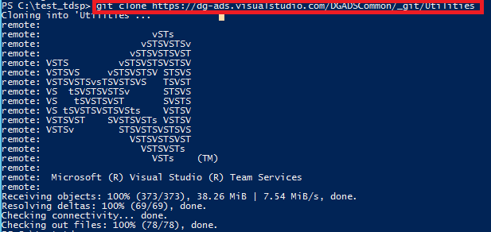
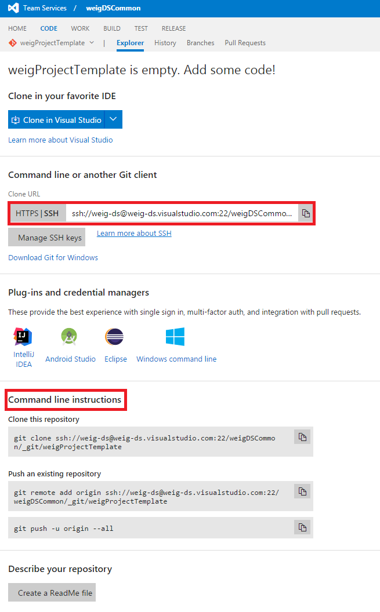
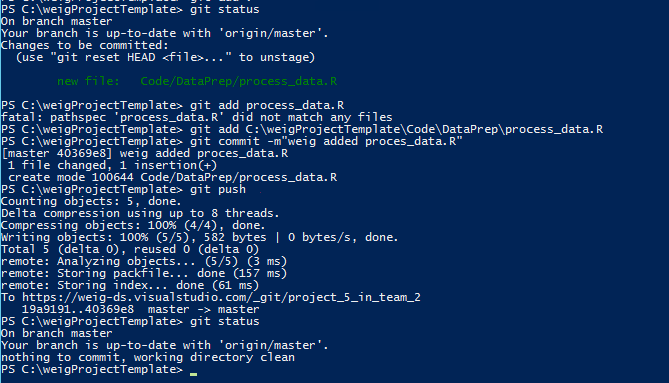
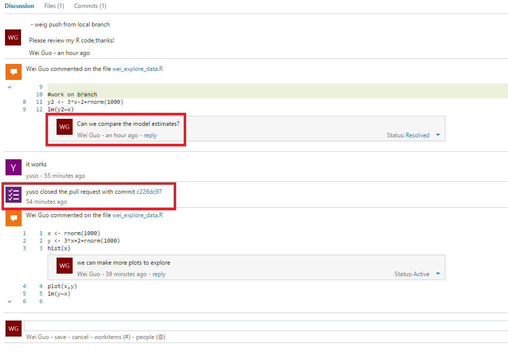

# Swim Lanes for VSO Tasks #

Before splitting

## VSO Setup: Group Manager ##

1. Create VSO account (VSO server, like dg-ads.visualstudio.com)

	Go to [Visual Studio online](https://www.visualstudio.com/), click sign in in the upper right corner.
	
	
	
	Sign in with your Microsoft account, registration is needed if you do not have an account.
	
	
	
	Click **Create New Account** in the upper right corner
	
	
	
	Fill in your server name, project name and other information. Here we choose Git to manage code. 
	
	
	
	After a few seconds, you will be directed to your VSO server.
	
	

2. Rename "MyFirstProject" to <Group>Common (on his Visio chart, it is named as MyFirstProject, like DGADSCommon) 

	Click the setting gear on the upper right corner and rename the project to **weigdsCommon**
	
	

3. Create Group Template repo (e.g., DGADSProjectTemplate) under <Group>Common

	Navigate to your project, click code, then click your project name, click **New Repositary** 
	
	

	

4. Create Group Utilities repo (like Utilities under DGADSCommon) (on vso online) 

    Similarly, you can create a Utilities repositary under your project: 

    

    Now you can see that under the project weigDSCommon, there are two repositaries: Utilities and weigProjectTemplate: 

    

5. Now you can clone project template and utilities from TDSP Visual Studio online server to your local machine. This can be done using PowerShell (Windows) and bash scripts (Linux).

	**Windows DSVM**
	
	Chocolaty and Git Credential Manager need to be installed before using Git. Run the following scripts in your Azure Powershell window:
	
		iwr https://chocolatey.org/install.ps1 -UseBasicParsing | iex
		choco install git-credential-manager-for-windows -y

	Then run the following scripts to clone Project Template from TDSP server:
	
		git clone https://dg-ads.visualstudio.com/DGADSCommon/_git/ProjectTemplate
	
	
	The ProjectTemplate will be cloned to the current directory in your local machine: 
	
	

	Utilities can be cloned in the same way: 
	
		git clone https://dg-ads.visualstudio.com/DGADSCommon/_git/Utilities

	

	**Linux DSVM**
	
	First generate a public SSH key, and add the key to SSH public keys in TDSP security setting page using this command. Copy the string starting with "ssh-rsa" and go to visual studio team server, click your name --> security --> SSH public keys --> +Add to store your paste save the copied string.

		ssh-keygen
		cat .ssh/id_rsa.pub

	
	
	

	

	Then run this script to clone Project Template to your local DSVN:

		git clone ssh://DG-ADS@dg-ads.visualstudio.com/DGADSCommon/_git/ProjectTemplate

	

	Utilities can be cloned in the same way:

		git clone ssh://DG-ADS@dg-ads.visualstudio.com/DGADSCommon/_git/Utilities

	

6. After the two repositories are cloned, you can push them (make changes if needed) to your visual studio online server. 

	**Windows DSVM**
	
	Go to Utitlies (or ProjectTemplate) folder, **delete .git file**, then run the following commands: in Microsoft Azure PowerShell: 

		git init
		git add .
		git commit -m "Your message goes here"
		git remote add myorigin https://weig-ds.visualstudio.com/weigDSCommon/_git/Utilities
		git push -u origin --all

	You will be prompt to enter your credentials to logon to your Virsual Studio server during this process.

	

	**Linux DSVM**

	Copy the public key you generated in previous step, and add it to your own team server in the same way so that you are able to push local files to your server.

	Go to Utitlies (or ProjectTemplate) folder, **delete .git file** (or zip all the files, make a copy), then run the following commands:

		git init
		git add .
		git commit -m "Your message goes here"
		git remote add myorigin ssh://weig-ds@weig-ds.visualstudio.com:22/weigDSCommon/_git/Utilities
		git push -u origin --all

	The SSH link can be found in your repositary's page in Visual Studio Online. HTTPS is for windows machine, and SSH is for Linux machine. 

	

	

	

7. Add Team leads to VSO Account (on vso online)

	In your Visual Studio Online homepage, click Users tab, then click Add, fill in the user's email, and set appropriate access level, then click send invitation button. Please refer to [this page](https://www.visualstudio.com/docs/work/connect/work-as-a-stakeholder) and [this page](https://www.visualstudio.com/products/visual-studio-team-services-feature-matrix-vs) to understand the differences among different access levels.

	

	

## Creating Teams: Team Lead ##

1. Create New Team Project

	Go to your group Visual Studio homepage, click New to create a new Team called DS\_Team_1. 

	

2. Rename default repository 

	After team is created, click Navigate to project, click Add code, then go to the upper lect corner, click DS_Team_1 --> Manage repositories, then rename the default repository to DS_Team_1_Utilities.

	

	

	

	

3. Create Team Template repository

	Click New repository, name it as DS\_Team\_1_Template, now you have two repositories under your team: team template and utilities. Template can be used to organize project files and utilities can be used as team tool box to store scripts, codes, etc.

	

	Then we can clone from our group template (weigDSCommon/weigProjectTemplate) to team template, and push it to our team repository. This is exactly the same as step 5 and 6 in the previous section.

4. Add team with appropriate access

	Click Security tab, then click members, then you can add members to your team. 

	

	

## Creating Projects: project lead ##

1. Create Team Project on Visual Studio Online

	In your team's Virtual Studio server, create new team project under team DS_Team_2, you will see that there is nothing in this project. 

	

	

	
	

2. Clone Team Template from team server and push to team project server

	This is exactly the same as step 5 and 6 in the first section. Your team's project template is cloned to your local machine, then it is pushed to your team's Visual Studio server.

	In **Windows DSVM**, run the following scripts in Azure PowerShell: (delete the .git folder before running)
	
		git init
		git commit -m"push team template to project 5 in team 2"
		git remote add origin https://weig-ds.visualstudio.com/_git/project_5_in_team_2
		git push -u origin --all

	

	

	Now you will see that the project repository is updated: 

	

	You can now use team template in your projects. If you make changes in your local machine, for example, you added a R file to Code/DataPrep folder, you can use the following scripts to push it to the server.

		git status
		git add C:\weigProjectTemplate\Code\DataPrep\process_data.R
		git commit -m"weig added process_data.R"
		git push
		

	

	In **Linux DSVM**, run the following scripts in terminal. You may need to create a [personal token](https://msdn.microsoft.com/library/dd286572(v=vs.120).aspx#setup_basic_auth
) to access team server. 

		git init
		git commit -m"push team template to project 5 in team 2"
		git remote add origin https://weig-ds.visualstudio.com/_git/project_5_in_team_2
		git push -u origin --all

	

	

3. Create feature under team project

	After your project is created under a team, go to  team overview page and click **Manage work** --> **Features** --> New Item, and then give some description on this feature. You can drag the feature to different stages in the board: New Active, Resolved, or Closed. The feature can also be assigned to a specific person in your team.

	

	

	
	
	

4. Add stories under feature

	Under the feature, you can add stories to list out the tasks needed for this feature. Click the story item, you can edit the status, description, comments, planning, priority, etc. You can switch the view from board to backlog, features to stories to check the status of your project.

	

	

5. Create shared storage assets

	Use this code snippet to create file share services for your team and project. For more details please refer to [GitHub](https://github.com/Azure/Azure-MachineLearning-DataScience/tree/master/Misc/TDSP).

 	**Windows DSVM**

        Login-AzureRmAccount
        Get-AzureRmSubscription | Format-Table
        # Select your subscription
        $sub = Read-Host 'Select the subscription name where resources will be created'
        Get-AzureRmSubscription -SubscriptionName $sub | Select-AzureRmSubscription
        $createornotsa = Read-Host 'Do you want to create a new storage account for your file share?'
        if (!$createornotsa -or $createornotsa.ToLower() -eq 'y'){
            $havegoodsaname = $false
            while(!$havegoodsaname) {
                $sa = Read-Host 'Enter the storage account name to create'
                $havegoodsaname = !(Test-AzureName -Storage $sa)
                if (!$havegoodsaname) { Write-Host "Storage Account already exists. Try a different name again." }
            }
            $rg = Read-Host 'Enter the resource group'
       
            # Create a new resource group if it does not exist. Default is southcentral (for now)
            $loc = 'southcentralus'
            try {
                $tmprg=Get-AzureRmResourceGroup -Name $rg
                Write-Host "Reusing Resource Group: "$rg
                $loc=$tmprg.Location
            }
            catch {
                New-AzureRmResourceGroup -Name $rg -Location $loc
            }
            # Create a new storage account. You can reuse existing storage account if you wish.
            New-AzureRmStorageAccount -Name $sa -ResourceGroupName $rg -Location $loc -Type 'Standard_LRS'
            # Set your current working storage account
        } else {
            Get-AzureRmStorageAccount | Format-Table
            $sa = Read-Host 'Enter the storage account name to reuse from above list'
            $rg = Read-Host 'Enter the resource group of thr storage account from above list'            
        }
        Set-AzureRmCurrentStorageAccount -ResourceGroupName $rg -StorageAccountName $sa

        # Create a Azure File Service Share
        $sharename = Read-Host 'Enter the name of the file share service to create'
        $s = New-AzureStorageShare $sharename
        # Create a directory under the FIle share. You can give it any name
        New-AzureStorageDirectory -Share $s -Path 'data' 
        # List the share to confirm that everything worked
        Get-AzureStorageFile -Share $s
        Write-Host "An Azure file share service created. It can be later mounted to the Azure virtual machines created for your team projects." -ForegroundColor "Green"
        Write-Host "Please keep a note for the information of the Azure file share service. It will be needed in the future when mounting it to Azure virtual machines" -ForegroundColor "Green"

	**Linux DSVM**

		#Create File share
		azure config mode arm
		loginstat=`azure account list --json | python -c 'import json,sys;obj=json.load(sys.stdin);print(len(obj)>0)'`
		if [ "$loginstat" = "False" ] ; then
		# Login to your Azure account
		echo "Follow direction on screen to login to your Azure account"
		azure login
		fi
		azure account list
		echo -n "Enter Subscription Name from above list: "
		read sub
		# Set the default subscription where we will create the share
		azure account set "$sub"
		echo -n "Enter storage account name where share is created: "
		read sacct
		echo -n "Enter resource group name : "
		read rgname
		echo -n "Create a new storage account? "
		read answer
		
		if echo "$answer" | grep -iq "^y" ;then
		#Create storage account
		    azure storage account create $sacct -g $rgname
		fi
		#Create storage account
		x=`azure storage account connectionstring show $sacct -g $rgname --json`
		# Extract the storage connectionstring with the keys
		y=`echo $x | python -c 'import json,sys;obj=json.load(sys.stdin);print(obj["string"])'`
		export AZURE_STORAGE_CONNECTION_STRING=$y
		
		echo -n "Enter the file share to create: "
		read shar
		# Create a mountable share
		azure storage share create $shar
		echo -n "Enter the directory to create in the file share: "
		read directory
		# Create an empty directory
		azure storage directory create $shar  $directory

## Project Resourcing ##

### Project lead ###

1. Team members can be added to your project in this way: go to **Users** in your server's homepage, click  **+Add**, fill in new member's email address and access level, an invitation will be sent to the user.

	

### IC ###

1. Provision VM (if not existing)

	Go to [Azure Portal](www.portal.azure.com) to provision a Data Science Virtual Machine. **+New** --> Data Science Virtual Machine, you can choose to a Windows or Linux data science virtual machine. Fill in the required information and your machine will be starting shortly.

	

	

	

	When your machine is provisioned, for Windows DSVM, you can use remote desktop to login and for linux DSVM, you can use ssh tools like Putty to login.

	
	
	

	

	

2. Create SSH key and add it to VSO
	
	In order to connect to your team's Visual Studio server from your linux virtual machine, you need to create a SSH key and add it to Visual Studio Online so that you can use git to sync your local files with remote server.

	First generate a public SSH key in your terminal using the following scripts. Copy the string starting with "ssh-rsa" and go to visual studio team server, click your name --> security --> SSH public keys --> +Add to store your paste save the copied string.

		ssh-keygen
		cat .ssh/id_rsa.pub

	
	
	

	

3. Clone Team Utilities

	**Windows DSVM**
	
	Chocolaty and Git Credential Manager need to be installed before using Git. Run the following scripts in your Azure Powershell window:
	
		iwr https://chocolatey.org/install.ps1 -UseBasicParsing | iex
		choco install git-credential-manager-for-windows -y

	Then run the following scripts to clone Team Utilities from team server:
	
		git clone https://weig-ds.visualstudio.com/weigDSCommon/_git/Utilities
	
	
	The repository address can be found this way: **team services** --> **your team** --> **code** --> **repository** --> **click Clone**

	 

	The team Utilities folder will be cloned to the current directory in your local machine: 
	
	

	**Linux DSVM**
	
	Make sure to add your SSH key to your team's security page to get authorization. Then run this script to clone team Utilies folder to your local DSVN:

		git clone ssh://weig-ds@weig-ds.visualstudio.com:22/weigDSCommon/_git/Utilities

	

4.  Clone Group Utilities

	This is the same as previous steps.

5. Clone Project repository

	This is the same as previous steps.

6. Attach file services storage

	**Windows DSVM**

	    # Authenticate to Azure.
	    if ((Get-AzureRmSubscription).Length -le 0) {
	        Login-AzureRmAccount
	    }
	
	    $sa = Read-Host 'Enter the storage account name where file share is created '
	    $rg = Read-Host 'Enter the resource group '
	    $storKey = (Get-AzureRmStorageAccountKey -Name $sa -ResourceGroupName $rg ).Key1
	
	    # Get Azure File Service Share details
	    $sharename = Read-Host 'Enter the name of the file share to mount'
	    $drivename = Read-Host 'Enter the name of the drive. This name should be different from the disk names your virtual machine has.'
	
	    # Save key securely
	    cmdkey /add:$sa.file.core.windows.net /user:$sa /pass:$storKey
	
	    # Mount the Azure file share as  drive letter on the VM. 
	    net use $drivename \\$sa.file.core.windows.net\$sharename

		$prompt = "Do you want to mount an Azure file share service to your Azure virtual machine? [Y]/N"
    
	    $mountornot = Read-Host -Prompt $prompt
	    if (!$mountornot -or $mountornot.ToLower() -eq 'y'){
	        
	        mountfileservices
	        $others = 1
	        DO{
	            $prompt = "Do you want to mount other Azure file share services? [Y]/N"
	            $mountornot = Read-Host -Prompt $prompt
	            if (!$mountornot -or $mountornot.ToLower() -eq 'y'){
	                mountfileservices
	            } else{
	                $others = 0
	            }
	        } while($others -eq 1)
	    }

	**Linux DSVM**

		#Mount file
		azure config mode arm
		loginstat=`azure account list --json | python -c 'import json,sys;obj=json.load(sys.stdin);print(len(obj)>0)'`
		if [ "$loginstat" = "False" ] ; then
		# Login to your Azure account
		echo "Follow direction on screen to login to your Azure account"
		azure login
		fi
		echo -n "Enter storage account name where share was created: "
		read sacct
		echo -n "Enter resource group name : "
		read rgname
		k=`azure storage account keys list  $sacct -g $rgname --json |  python -c 'import json,sys;obj=json.load(sys.stdin);print(obj["key1"])'`
		
		echo -n "Enter the file share to mount: "
		read shar
		echo -n "Enter the directory where to mount the share : "
		read directory
		sudo mkdir -p /$directory
		sudo mount -t cifs //$sacct.file.core.windows.net/$shar /$directory -o vers=3.0,username=$sacct,password=$k,dir_mode=0777,file_mode=0777

After successfully attaching the storage, you will see it in your local machine.

## Project Execution ##

### Project Lead ###

1. Sprint planning (stories and tasks)

	After your project is created under a team, go to  team overview page and click **Manage work** --> **Features** --> New Item, and then give some description on this feature. You can drag the feature to different stages in the board: New Active, Resolved, or Closed. The feature can also be assigned to a specific person in your team.

	

	

	
	
	

	Under the feature, you can add stories to list out the tasks needed for this feature. Click the story item, you can edit the status, description, comments, planning, priority, etc. You can switch the view from board to backlog, features to stories to check the status of your project.

	

	

2. Review Pull requests, merge

	After the review is done, branch can be merged to the master repository. After the merge, the topic branch (for example, jamal/breakfast) is still in the repository. To keep your repository from getting cluttered by obsolete branches, you can delete the topic branch in your web browser.

	

	

### IC ###
1. Add Tasks in current iteration

	In the current iteration backlog, click New to create new task. Click the **+** icon to set it to be a task or a bug. Click the item to add more details.

	

	

2. Create branch for task working on

	To create a branch, use git checkout -b <new-branch-name> [<base-branch-name>], where base-branch-name is optional and defaults to master. I'm going to create a new branch called weig_pull_request_2 from the master branch and push it to team server.

		git pull origin master
		git checkout -b weig_pull_request_2
		git push origin weig_pull_request_2
		git status

	

3. check out branch in project folder

	You can work in your local project folder to make modifications.

4. Modify/add files

   	Now you made some changes in the R file in your local machine.

	

5. Commit, push to origin branch
	
	You can commit thoses changes to the branch using the regular Git commands.
	
		git status
		git add .
		git commit -m"Wei added variable Z in R"
		git push
	
6. create pull request to master

	

7. Add reviewers

	Go to your team server, under your project page, you can see your branch is listed. Reviewers can be added to review your work through creating a pull request. Then your reviewers can make comments on your work.

	

	

	

	

