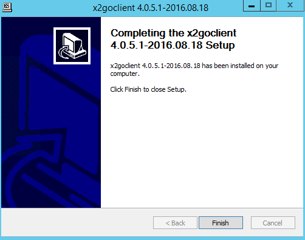
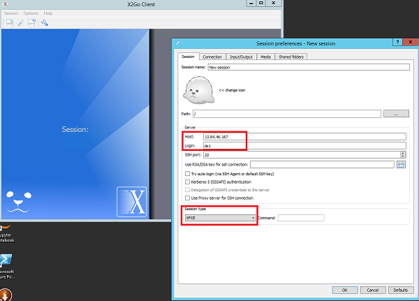
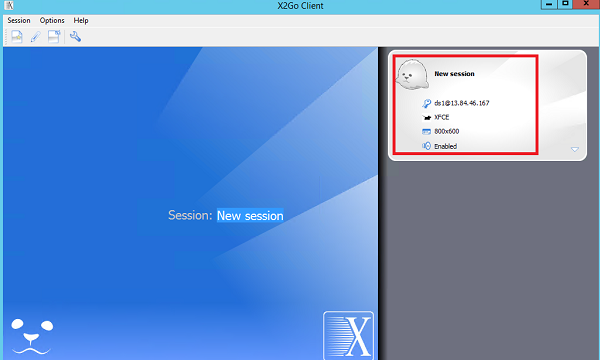
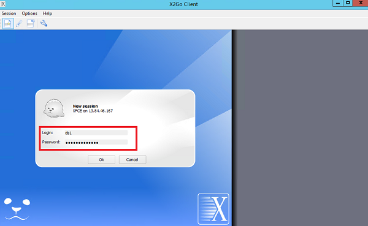
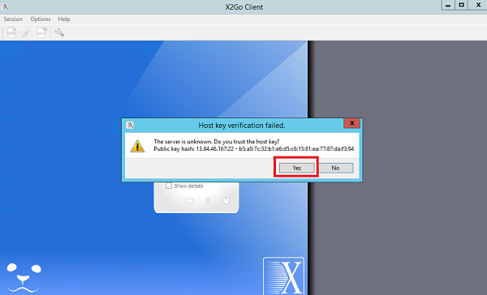
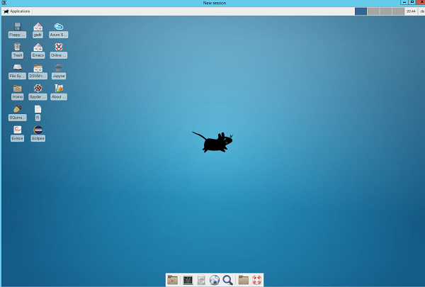
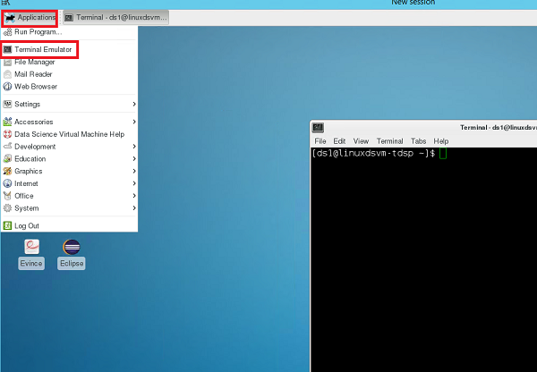
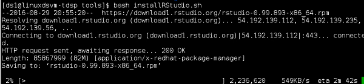
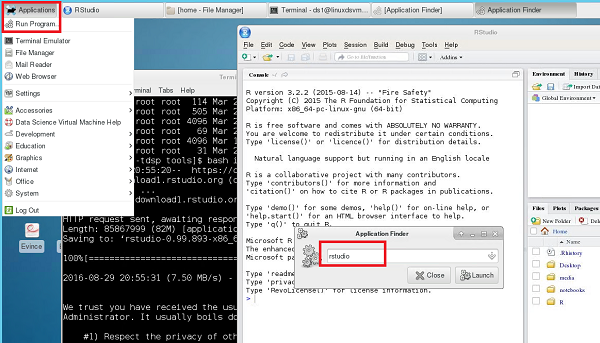

# Access your Linux DSVM from X2Go #

1. Download client for Windows from [here](http://code.x2go.org/releases/binary-win32/x2goclient/releases/4.0.5.1-2016.08.18/x2goclient-4.0.5.1-2016.08.18-setup.exe).
2. Install it on your Windows machine and follow the instructions during installation

	

3. Open X2Go Client and fill in the host information, login name, and change session type to **XFCE**
	
	

4. Double click the session you just created and type in your password
	
	

	

5. Click Yes, when you are asked to trust the host key or not

	

6. You will be brought to your Linux DSVM desktop

	

7. Install Rstudio on your Linux DSVM
	
	- open terminal from applications, 

	

	- run the following bash script (password needed)
	
	    cd /dsvm/tools/
	
	    bash installRStudio.sh

	

8. Go to Applications --> Run Program --> type **rstudio** to launch Rstudio

	 
