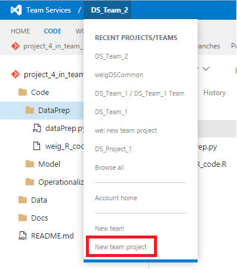
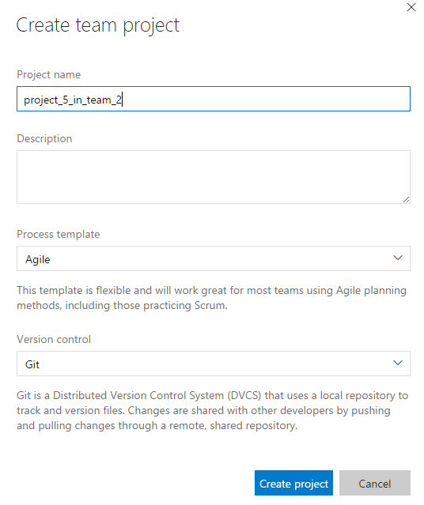
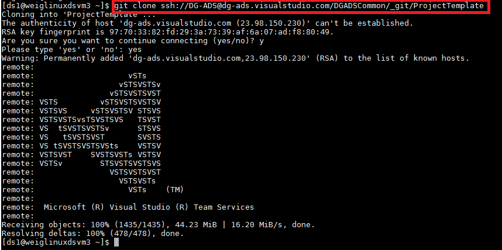

# Create Project

This document describes how a project leader creates a new project repository.

## Details
1. [Create project](#create-project)
2. [Clone Team Template](#clone-team-template)
3. [Create Feature for Project](#create-feature-for-project)
4. [Add Stories](#add-stories)
5. [Create Storage Assets](#create-storage-assets)

## Create Project

In your team's Virtual Studio online server, click **New team project** to create new team project under your team. Here we created a project called project_5_in_team_2 under team DS\_Team\_2. You can see there is no code and work under this project.

## Clone Team Template

Now you can clone project template and utilities from your team's Visual Studio online server to your local machine. This can be done using PowerShell (Windows) and bash scripts (Linux).

**Windows DSVM**

Chocolaty and Git Credential Manager need to be installed before using Git. Run the following scripts in your Azure Powershell window:

	iwr https://chocolatey.org/install.ps1 -UseBasicParsing | iex
	choco install git-credential-manager-for-windows -y

Then run the following scripts to clone Project Template from TDSP server:

	git clone https://dg-ads.visualstudio.com/DGADSCommon/_git/ProjectTemplate

The ProjectTemplate will be cloned to the current directory in your local machine: 

Utilities can be cloned in the same way: 

	git clone https://dg-ads.visualstudio.com/DGADSCommon/_git/Utilities

**Linux DSVM**

First generate a public SSH key, and add the key to SSH public keys in TDSP security setting page using this command. Copy the string starting with "ssh-rsa" and go to visual studio team server, click your name --> security --> SSH public keys --> +Add to store your paste save the copied string.

	ssh-keygen
	cat .ssh/id_rsa.pub

Then run this script to clone Project Template to your local DSVM:

	git clone ssh://DG-ADS@dg-ads.visualstudio.com/DGADSCommon/_git/ProjectTemplate

Utilities can be cloned in the same way:

	git clone ssh://DG-ADS@dg-ads.visualstudio.com/DGADSCommon/_git/Utilities

## Add Stories

In the project backlog, under feature, you can add stories to list out the tasks needed for this feature. Click the story item, you can edit the status, description, comments, planning, priority, etc. You can switch the view from board to backlog, features to stories to check the status of your project.

## Create Storage Assets (As needed)

Use this code snippet to create file share services for your team and project. The file share storage can be mounted to team member's local machine for project use. For more details please refer to [GitHub](https://github.com/Azure/Azure-MachineLearning-DataScience/tree/master/Misc/TDSP).

**Windows DSVM**

    Login-AzureRmAccount
    Get-AzureRmSubscription | Format-Table
    # Select your subscription
    $sub = Read-Host 'Select the subscription name where resources will be created'
    Get-AzureRmSubscription -SubscriptionName $sub | Select-AzureRmSubscription
    $createornotsa = Read-Host 'Do you want to create a new storage account for your file share?'
    if (!$createornotsa -or $createornotsa.ToLower() -eq 'y'){
        $havegoodsaname = $false
        while(!$havegoodsaname) {
            $sa = Read-Host 'Enter the storage account name to create'
            $havegoodsaname = !(Test-AzureName -Storage $sa)
            if (!$havegoodsaname) { Write-Host "Storage Account already exists. Try a different name again." }
        }
        $rg = Read-Host 'Enter the resource group'
   
        # Create a new resource group if it does not exist. Default is southcentral (for now)
        $loc = 'southcentralus'
        try {
            $tmprg=Get-AzureRmResourceGroup -Name $rg
            Write-Host "Reusing Resource Group: "$rg
            $loc=$tmprg.Location
        }
        catch {
            New-AzureRmResourceGroup -Name $rg -Location $loc
        }
        # Create a new storage account. You can reuse existing storage account if you wish.
        New-AzureRmStorageAccount -Name $sa -ResourceGroupName $rg -Location $loc -Type 'Standard_LRS'
        # Set your current working storage account
    } else {
        Get-AzureRmStorageAccount | Format-Table
        $sa = Read-Host 'Enter the storage account name to reuse from above list'
        $rg = Read-Host 'Enter the resource group of thr storage account from above list'            
    }
    Set-AzureRmCurrentStorageAccount -ResourceGroupName $rg -StorageAccountName $sa

    # Create a Azure File Service Share
    $sharename = Read-Host 'Enter the name of the file share service to create'
    $s = New-AzureStorageShare $sharename
    # Create a directory under the FIle share. You can give it any name
    New-AzureStorageDirectory -Share $s -Path 'data' 
    # List the share to confirm that everything worked
    Get-AzureStorageFile -Share $s
    Write-Host "An Azure file share service created. It can be later mounted to the Azure virtual machines created for your team projects." -ForegroundColor "Green"
    Write-Host "Please keep a note for the information of the Azure file share service. It will be needed in the future when mounting it to Azure virtual machines" -ForegroundColor "Green"

**Linux DSVM**

	#Create File share
	azure config mode arm
	loginstat=`azure account list --json | python -c 'import json,sys;obj=json.load(sys.stdin);print(len(obj)>0)'`
	if [ "$loginstat" = "False" ] ; then
		# Login to your Azure account
		echo "Follow direction on screen to login to your Azure account"
		azure login
	fi
	azure account list
	echo -n "Enter Subscription Name from above list: "
	read sub
	# Set the default subscription where we will create the share
	azure account set "$sub"
	echo -n "Enter storage account name where share is created: "
	read sacct
	echo -n "Enter resource group name : "
	read rgname
	echo -n "Create a new storage account? "
	read answer
	
	if echo "$answer" | grep -iq "^y" ;then
	    #Create storage account
	    azure storage account create $sacct -g $rgname
	fi
	#Create storage account
	x=`azure storage account connectionstring show $sacct -g $rgname --json`
	# Extract the storage connectionstring with the keys
	y=`echo $x | python -c 'import json,sys;obj=json.load(sys.stdin);print(obj["string"])'`
	export AZURE_STORAGE_CONNECTION_STRING=$y
	
	echo -n "Enter the file share to create: "
	read shar
	# Create a mountable share
	azure storage share create $shar
	echo -n "Enter the directory to create in the file share: "
	read directory
	# Create an empty directory
	azure storage directory create $shar  $directory

