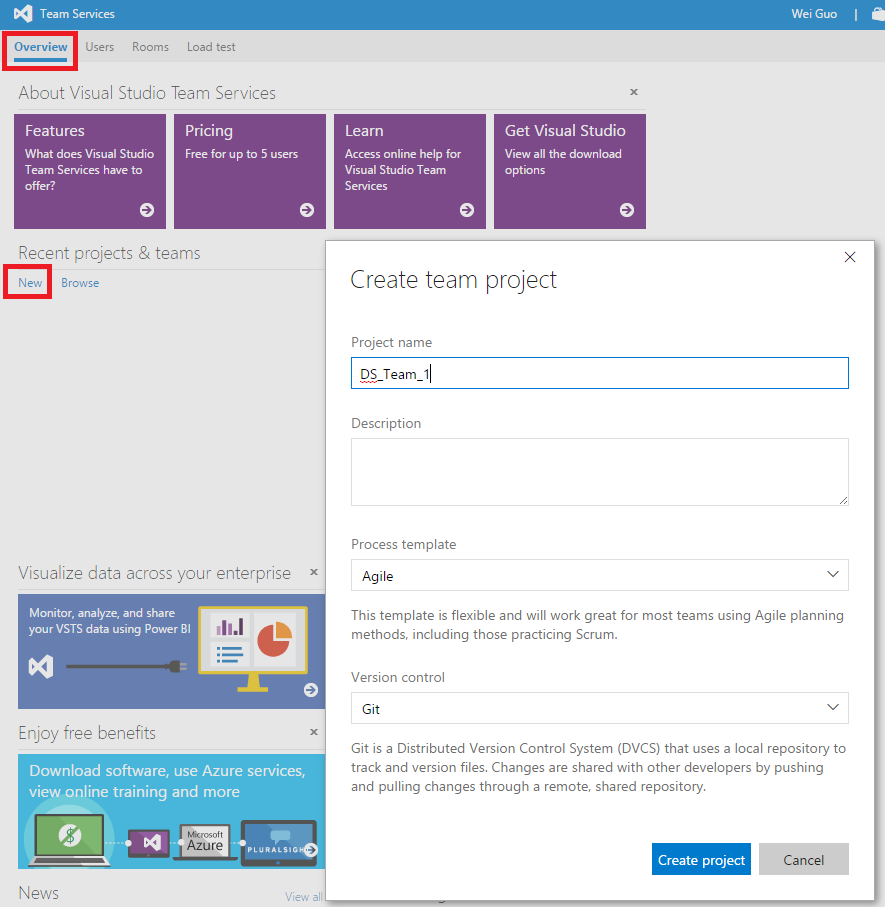
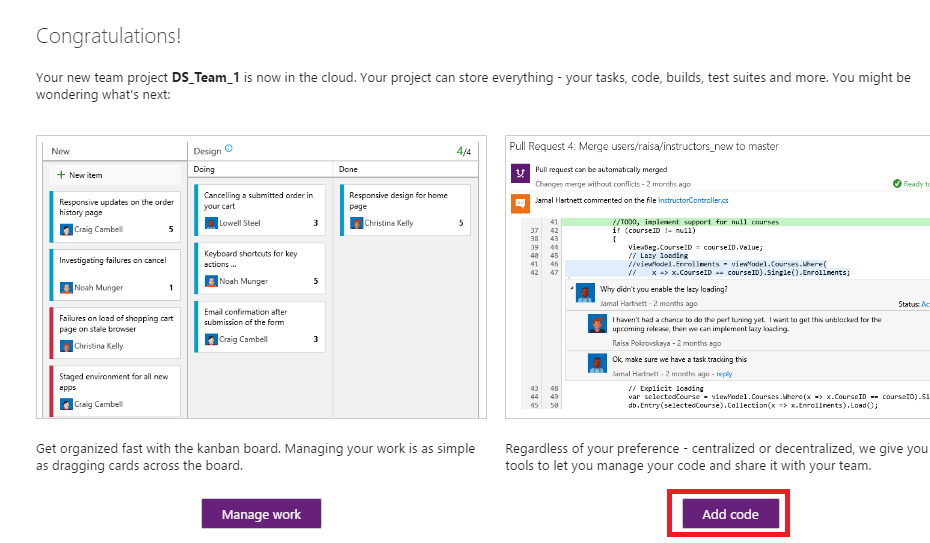
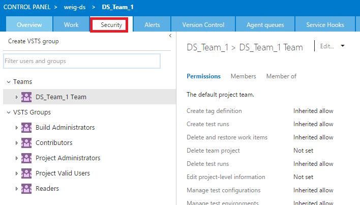

# Create Teams

This document describes how to create environments in VSTS for different teams within a data science group.

## Details
1. [Create new Team Project](#create-new-team-project)
2. [Rename Default Repo](#rename-default-repo)
3. [Create TeamTemplate Repo](#create-teamtemplate-repo)
4. [Add Team](#add-team)

## Create new Team Project

Go to your team's Visual Studio Online homepage, click **New** to create a new Team called DS\_Team_1. 

## Rename Default Repo 

After team is created, click **Navigate to project**, click **Add code**, then go to the upper left corner, click **DS_Team_1** --> **Manage repositories**, then rename the default repository to DS\_Team\_1\_Utilities.

## Create TeamTemplate Repo

Click New repository, name it as DS\_Team\_1_Template, now you have two repositories under your team: team template and utilities. Template can be used to organize project files and utilities can be used as team tool box to store scripts, codes, etc.

Then we can clone from our group template (weigDSCommon/weigProjectTemplate) to team template, and push it to our team repository. This is exactly the same as step 5 and 6 in the previous section.

## Add Team

Within your team page, click **Security** tab, then click **Members**, then you can add members to your team and set permissions for team members.

