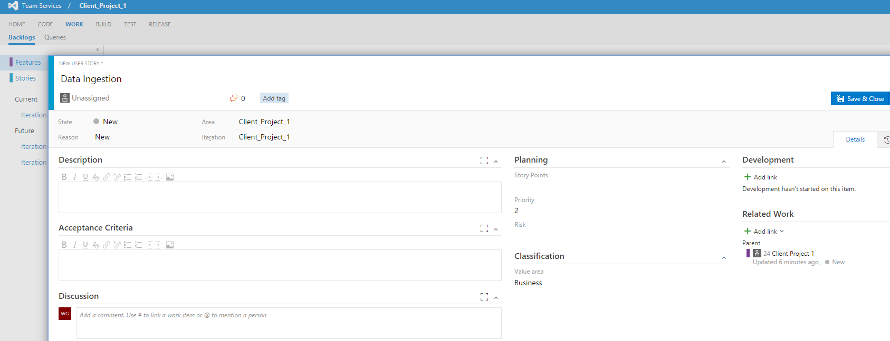
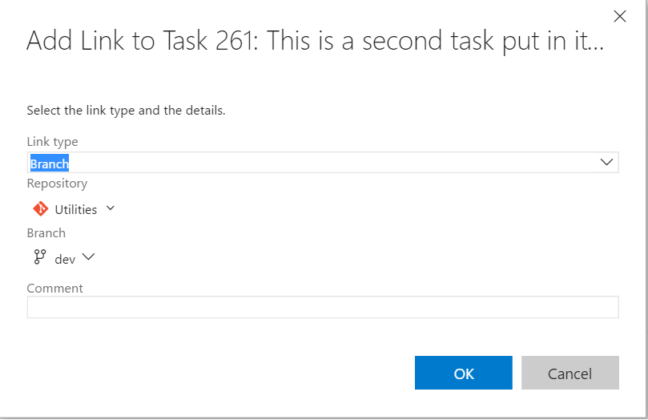
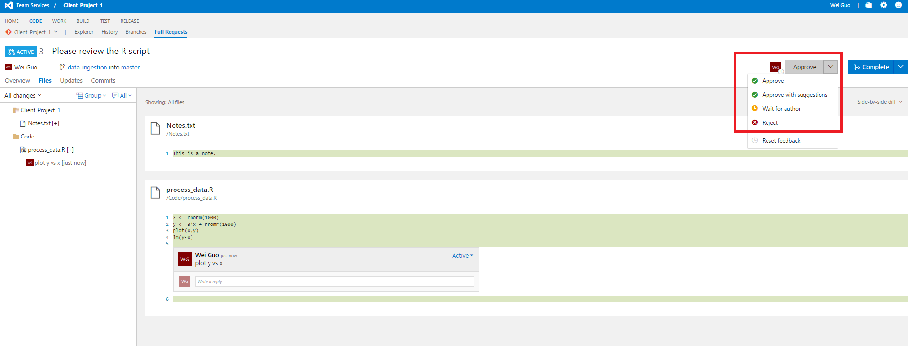
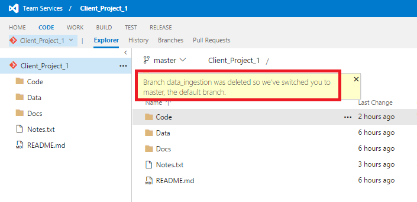

# Typical Data Science Project Execution

This document describes how a data scientist can execute a data science project in a trackable, version controlled, and collaborative way within a project team. It covers instructions on (1) how to do sprint planning, (2) how to add work items to sprint, (3) link the work items with coding activities tracked by git, and (4) how to do code review. Features (3) and (4) are the benefits you can get naturally if you choose to use VSTS. 

>The following instructions are developed based on that VSTS is the code hosting platform, which is the one we choose for TDSP at Microsoft. If other code hosting platform is used for your group, the way of project execution might be slightly different. For example, function 6 _Link a work item with a git branch_ might not be as easy as on VSTS.

1. [Terminology](#Terminology-1)
2. [Sprint Planning](#SprintPlanning-2)
3. [Add Feature](#AddFeature-3)
4. [Add Story under feature](#AddStoryunderfeature-4)
5. [Add Task under story](#AddTaskunderstory-5)
6. [Link a work item with a git branch](#Linkaworkitemwithagitbranch-6)
7. [Work on a Branch and Commit the Changes](#WorkonaBranchandCommittheChanges-7)
8. [Create a pull request on VSTS](#CreateapullrequestonVSTS-8)
9. [Review and Merge](#ReviewandMerge-9)
10. [Data Quality Report Utility ](#DataQualityReportUtility-10)
11. [Modeling Utility ](#ModelingUtility-11)
12. [Tracking Progress of Projects via PowerBI Dashboards](#PowerBI-12)

##  1. Terminology 

In TDSP, there are four mostly used types of work items: **Feature**, **User Story**, **Task**, **Bug**. Here are their definitions. Please keep in mind that all work items are collected in a single backlog of the team project. There is no backlog at the git repository level under a team project. 

- _Feature_: A feature corresponds to a project. Different engagements with the same client should be different features. Similarly, different phases of the same project with the same client should also be different features. You can choose _ClientName-EngagementName_ as the feature name so that you can easily recall context of the project/engagement from the names. 
- _Story_: Stories are different steps that are needed to complete a feature (project) end to end. Examples of stories include _Getting Data_, _Exploring Data_, _Generating Features_, _Building Models_, _Operationalizing Models_, _Retraining Models_, etc. 
- _Task_: Tasks are assignable coding/documenting and other activities that need to be done in order to complete a specific story. For example, tasks in story _Getting Data_ can be _Getting Credentials of SQL Server_, _Uploading Data to SQL Data Warehouse_, etc. 
- _Bug_: Bug usually refers to a fix that is needed to an existing code/document that is done when completing a task. It can escalate to Story/Task if the bug is caused by missing stages/tasks. 

##  2. Sprint Planning 

Sprint planning is very useful for project prioritization, and resource planning and allocation, especially almost ubiquitously each data scientist is carrying on multiple projects, each project takes months to complete, and different projects proceed with different paces and are at different stages at the same time. On VSTS server, you can easily create, manage, and track work items in your team project, and conduct sprint planning to ensure that your project is moving forward as expected. 

##  3. Add Feature  

After your project repository is created under a team project, go to **team overview** page and click **Manage work** --> **Features** --> **New**, Type in the feature name (usually your project name), and click **Add** to include this feature in the backlog.

Double click the feature you just created, you can fill in some descriptions, assign team members for this feature, and set planning parameters for this feature. You can also link this feature to the project repository by clicking **Add link** under the **Development** section. After finishing editing the feature, you can click **Save & Close** to exit.

##  4. Add Story under feature 

Under the feature, stories can be added to describe major steps needed to finish the project (feature). Click the **+** sign next to the feature under backlog view to add a new story. In the pop up window, you can edit the details of the story, like the status, description, comments, planning, priority, etc. 

You can link this story to an existing repository by clicking **+ Add link** under **Development**. 

##  5. Add Task under story 

Tasks are specific detailed steps that are needed to complete each story. After all tasks of a story are completed, the story should be completed too. Click the **+** sign next to the story item, select _task_, and then fill in the detailed information of this task in the pop-up window.

After the features, stories, and tasks are created, you can view them in the backlog or board to track their status.

##  6. Link a work item with a git branch 

VSTS provides a convenient way to connect a work item (story or task) with a git branch. This enables you to track what has been done on the process of completing a work item. 

You can connect a work item to a new branch. Double click a work item, and in the pop-up window, click **Create a new branck** under _+ Add link_. Then, you need to provide detailed information of this new branch, such as the branch name, base git repository and the branch. The git repository can only be repository under the same team project that the work item belongs to. The base branch can be the master branch, or some existing branch. 

A good practice is that you create a branch for each story work item. Then, for each task work item, you create a branch based from the story branch. Such branching mechanism will be very helpful when you have multiple people working on different stories of the same project, or you have multiple people working on different tasks of the same story. Each member working on different branch, and on each branch each member working on different codes and/or other artifacts can avoid conflicts as much as possible. 

The following picture depicts the recommended branching strategy for TDSP. Please keep in mind that you might not need so many branches, especially when you only have one or two people working on the same project. But separating development branch from master branch is always a good practice. This can help prevent the release branch from being interrupted by the development activities. More complete description of git branch model can be found in [A Successful Git Branching Model](http://nvie.com/posts/a-successful-git-branching-model/).

After the branch is created, in shell command (Windows or Linux), run the following command to switch to the branch you want to work on. Change the <branch name\> to **master** switches back to the **master** branch.

	git checkout <branch name>

After you switch to the working branch, you can start working on that work item by developing artifacts like coding, documentation, etc. 

You can also link a work item to an existing branch. In the detail page of a work item, instead of  clicking _Create a new branch_, you click _**+ Add link**_. Then, select the branch you want to link the work item to. 

##  7. Work on a Branch and Commit the Changes 

Now suppose you make some change to the branch for the work item, such as you add a R file on the branch in your local machine.

Assuming that you are in the branch for this work item in your git shell. You can commit the added R file to the branch using the following Git commands, where _data\_ingestion_ is the branch name. 

	git status
	git add .
	git commit -m"added a R scripts"
	git push origin data_ingestion

##  8. Create a pull request on VSTS 

After a few commits and pushes, if you feel that the current branch should be merged to its base branch, you should make a **pull request** on VSTS server. 

Go to the main page of your team project, click **CODE**. Then, select the git repository name that you want to merge the branches. Then click **Pull Requests**, click **New pull request** to create a pull request review before the work on the branch is merged to its base branch.

Fill in some description about this pull request, add reviewers, and send it out.

##  9. Review and Merge 

After the pull request is created, your reviewers will get an email notification to review the pull requests. The reviewers need to check whether the changes are working or not, test the changes with the requester if possible. Based on the assessmemt of the reviewers, they can approve or reject the pull request. 

After the review is done, the working branch will be merged to its base branch by clicking the **Complete** button. You may choose to delete the working branch after merging. 

You will find that on the top left corner, it is marked as **COMPLETED**. 

When you go back to the repository under **CODE**, you will be told that you are switched to master branch.

You can also use the following Git commands to merge your working branch to its base branch and delete the working branch after merging.

	git checkout master
	git merge data_ingestion
	git branch -d data_ingestion

##  10. Interactive Data Exploration, Analysis, and Reporting (IDEAR) Utility
This R-markdown based utility provides a flexible and interactive tool to evaluate and explore data sets. Users can quickly generate reports from the data set with minimal coding. The report includes descriptive statistics of the data set and variables, association analysis among variables, principal component analysis of variables, and other visualization tools. Users can export the exploration results to a final report, which can be delivered to clients, or used to make decisions on which variables to include in the modeling step.

At this time, the tool only works on data-frames in memory. A .yaml file is needed to specify parameters of the data-set and exploration. For detailed information, please go to [Data-Quality-Report-Utility](../DataScienceUtilities/DataReport-Utils/Data-Quality-Report-Utility.html).

##  11. Baseline Modeling and Reporting Utility

This utility provides a customizable semi-automated tool to perform model creation with hyper-parameter sweeping, and compare the accuracy of those models. 

The model creation utility is an R markdown file that can be run to produce a self-contained html output with a table of contents (ToC) for easy navigation through different sections. When the markdown file is run (knit), three algorithms (regularized regression using glmnet package, random forest using randomForest package, boosting trees using xgboost package) are executed to give trained models. Accuracy of the models are then compared, and relative feature importance plots are reported. Currently, there are two utilities, one is for binary classification task and the other one is for regression task . The primary differences being the way control parameters and accuracy metrics are specified for these learning tasks. 

A Yaml file is used as input to specify data input (SQL source or R-Data file), what portions of data are to be used for training and testing, which algorithms to run, control parameters for model optimization (cross-validation or bootstrapping, folds of cross-validation, etc.), and the hyper-parameter sets for each algorithm. The number of algorithms, the number of folds for optimization, the hyper-parameters, and the number of hyper-parameter sets to sweep over can be modified in the Yaml file to run the models quickly (e.g. with lower number of CV folds, lower number of parameter sets) or more comprehensively (higher number of CV folds, larger number of parameter sets), as needed.

For detailed information, please go to [Modeling-Utility](../DataScienceUtilities/Modeling/Modeling-Utility.html).

##  12. Tracking Progress of Projects via Power BI Dashboards
For data science group managers, team leads, and project leads, it is a point of interests to know the progress of project(s), what has been done and by whom, and the to-do lists. If you are using VSTS, you are able to build Power BI dashboards to track the Git repositories activities and the work items. Detailed instructions on how to connect Power BI to Visual Studio Team Services can be found [here](https://www.visualstudio.com/en-us/docs/report/powerbi/connect-vso-pbi-vs). 

After the data of VSTS is connected to Power BI, you can easily set up dashboards to track your Git repository activities, and your work items. To learn how to create Power BI dashboards and reports, please click [here](https://www.visualstudio.com/en-us/docs/report/powerbi/report-on-vso-with-power-bi-vs). 

Here are two simple example dashboards we build to track Git activities and work items, respectively. 

In this example dashboard, the git commitment activities by different users, on different dates, and on different repositories are listed. You can easily slice and dice to filter the ones you are interested in.

In this example dashboard, the work items (stories and tasks) in different iterations are presented. They are grouped by assignees and priority levels, and colored by state. 