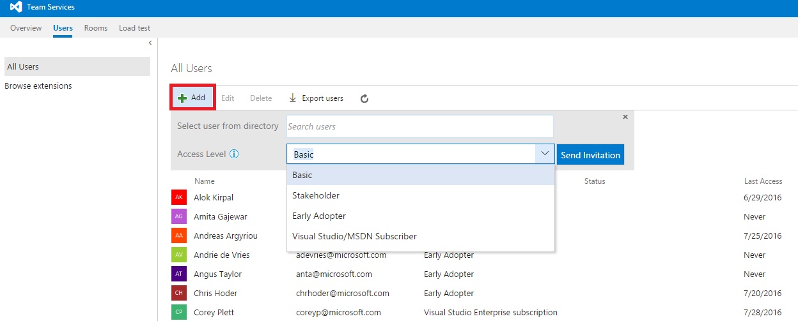
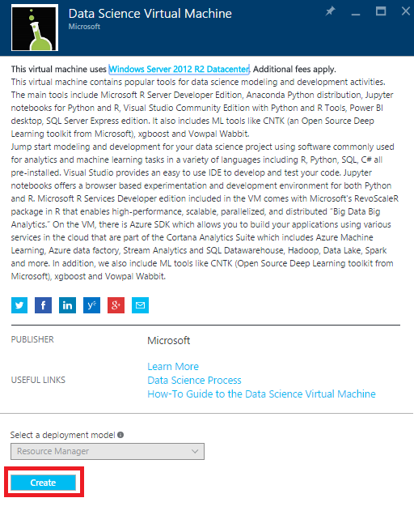
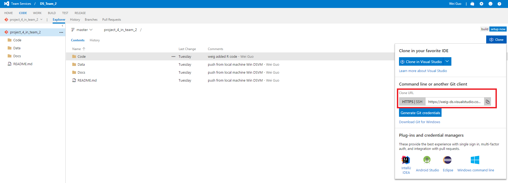
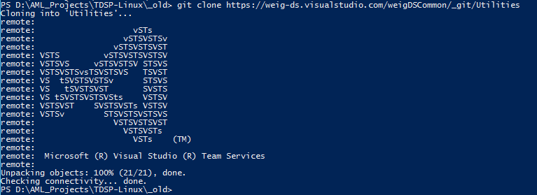
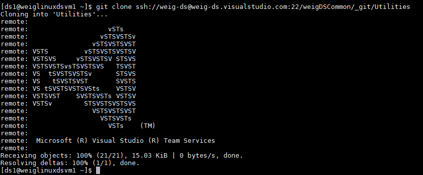
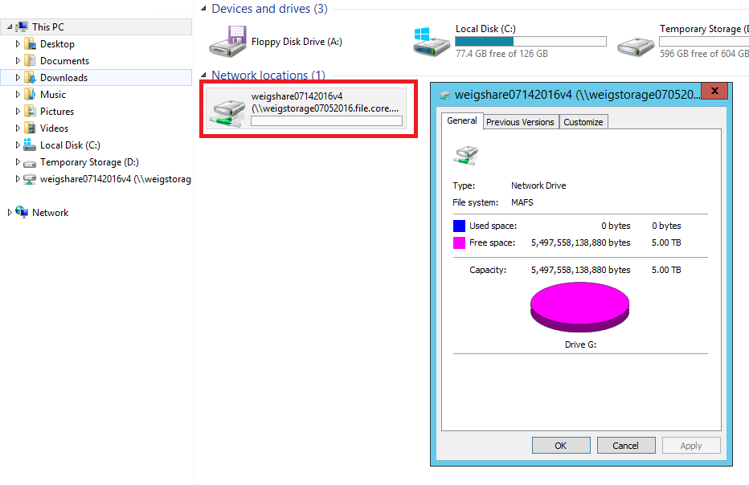
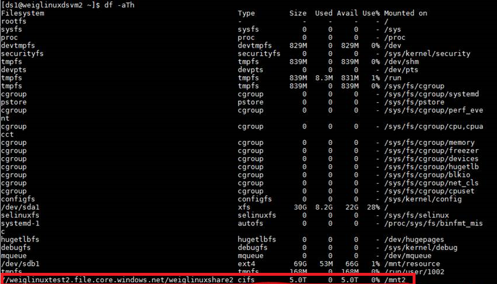

# Project Resourcing

This document describes how team members join a project.

## Details
1. [Add team member to project](#Add-team-member-to-project)
2. [Provision VM](#Provision-VM)
3. [Create ssh key and add it to VSO](#Create-ssh-key)
4. [Clone Team Utilities](#Clone-Team-Utilities)
5. [Clone Group Utilities](#Clone-Group-Utilities)
6. [Clone Project repo](#Clone-Project-repo)
7. [Attach storage](#Attach-storage)

## Add team member to project

Team members can be added to your project in this way: navigate to your team's homepage, in **Team Members**, click **Invite a friend** to add team members to your project.

Or you can go to **Users** in your server's homepage, click  **+Add**, fill in new member's email address and access level, an invitation will be sent to the user.

## Provision VM

Go to [Azure Portal](www.portal.azure.com) to provision a Data Science Virtual Machine. **+New** --> **Data Science Virtual Machine**, you can choose to a Windows or Linux data science virtual machine. Fill in the required information and your machine will be starting shortly.

When your machine is provisioned, for Windows DSVM, you can use remote desktop to login and for linux DSVM, you can use ssh tools like Putty to login.

## Create ssh key

In order to connect to your team's Visual Studio server from your linux virtual machine, you need to create a SSH key and add it to Visual Studio Online so that you can use git to sync your local files with remote server.

First generate a public SSH key in your terminal using the following scripts. Copy the string starting with "ssh-rsa" and go to visual studio team server, click your name --> security --> SSH public keys --> +Add to store your paste save the copied string.

	ssh-keygen
	cat .ssh/id_rsa.pub

## Clone Team Utilities

**Windows DSVM**

Chocolaty and Git Credential Manager need to be installed before using Git. Run the following scripts in your Azure PowerShell window:

	iwr https://chocolatey.org/install.ps1 -UseBasicParsing | iex
	choco install git-credential-manager-for-windows -y

Then run the following scripts to clone Team Utilities from team server:

	git clone https://weig-ds.visualstudio.com/weigDSCommon/_git/Utilities

The repository address can be found this way: **team services** --> **your team** --> **code** --> **repository** --> **click Clone**

 

The team Utilities folder will be cloned to the current directory in your local machine: 

**Linux DSVM**

Make sure to add your SSH key to your team's security page to get authorization. Then run this script to clone team Utilies folder to your local DSVN:

	git clone ssh://weig-ds@weig-ds.visualstudio.com:22/weigDSCommon/_git/Utilities

## Clone Group Utilities

This is similar to previous steps.

## Clone Project repo

This is similar to previous steps.

## Attach storage

You can attach extra storage created by your project or team lead to your local machine using the following commands.

**Windows DSVM**

    # Authenticate to Azure.
    if ((Get-AzureRmSubscription).Length -le 0) {
        Login-AzureRmAccount
    }

    $sa = Read-Host 'Enter the storage account name where file share is created '
    $rg = Read-Host 'Enter the resource group '
    $storKey = (Get-AzureRmStorageAccountKey -Name $sa -ResourceGroupName $rg ).Key1

    # Get Azure File Service Share details
    $sharename = Read-Host 'Enter the name of the file share to mount'
    $drivename = Read-Host 'Enter the name of the drive. This name should be different from the disk names your virtual machine has.'

    # Save key securely
    cmdkey /add:$sa.file.core.windows.net /user:$sa /pass:$storKey

    # Mount the Azure file share as  drive letter on the VM. 
    net use $drivename \\$sa.file.core.windows.net\$sharename

	$prompt = "Do you want to mount an Azure file share service to your Azure virtual machine? [Y]/N"

    $mountornot = Read-Host -Prompt $prompt
    if (!$mountornot -or $mountornot.ToLower() -eq 'y'){
        
        mountfileservices
        $others = 1
        DO{
            $prompt = "Do you want to mount other Azure file share services? [Y]/N"
            $mountornot = Read-Host -Prompt $prompt
            if (!$mountornot -or $mountornot.ToLower() -eq 'y'){
                mountfileservices
            } else{
                $others = 0
            }
        } while($others -eq 1)
    }

**Linux DSVM**

	#Mount file
	azure config mode arm
	loginstat=`azure account list --json | python -c 'import json,sys;obj=json.load(sys.stdin);print(len(obj)>0)'`
	if [ "$loginstat" = "False" ] ; then
	# Login to your Azure account
	echo "Follow direction on screen to login to your Azure account"
	azure login
	fi
	echo -n "Enter storage account name where share was created: "
	read sacct
	echo -n "Enter resource group name : "
	read rgname
	k=`azure storage account keys list  $sacct -g $rgname --json |  python -c 'import json,sys;obj=json.load(sys.stdin);print(obj["key1"])'`
	
	echo -n "Enter the file share to mount: "
	read shar
	echo -n "Enter the directory where to mount the share : "
	read directory
	sudo mkdir -p /$directory
	sudo mount -t cifs //$sacct.file.core.windows.net/$shar /$directory -o vers=3.0,username=$sacct,password=$k,dir_mode=0777,file_mode=0777

