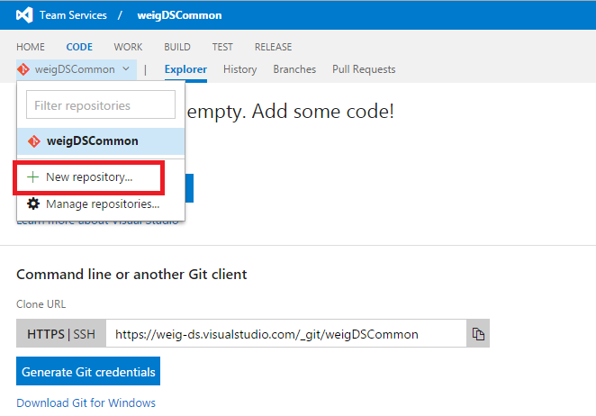
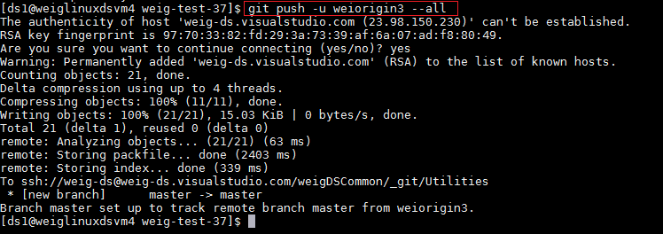
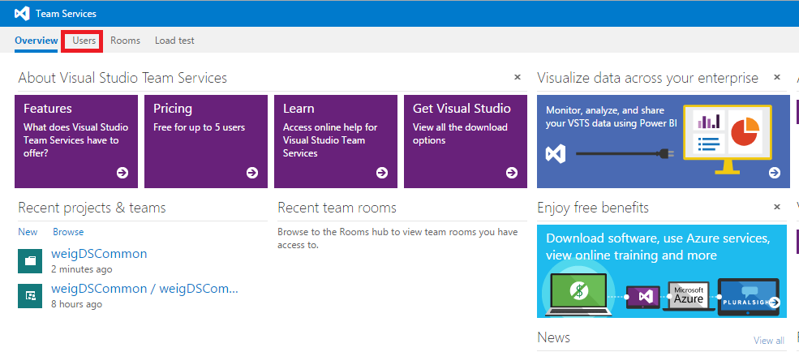
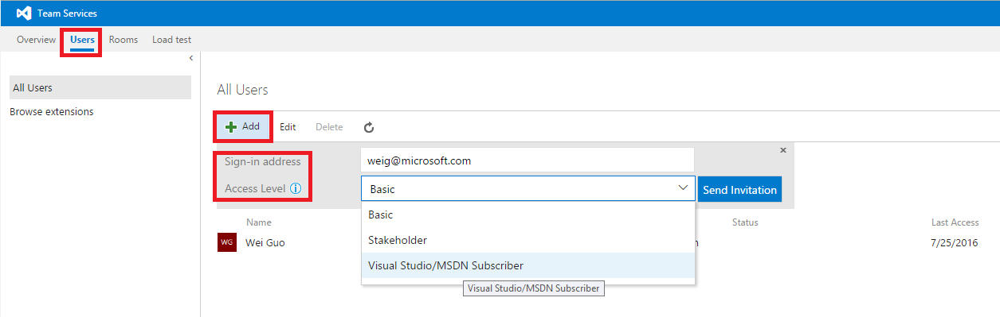

# Visual Studio Online Signup

This document describes the detailed steps that the data science group leader would take to sign up for a Visual Studio Online account and configure it for the TDSP.

## Details
1. [Create VSO Account](#create-vso-account)
2. [Rename Default Repository](#rename-default-repo)
3. [Create Group Template repo](#create-group-template-repo)
4. [Create Group Utilities repo](#create-group-utilities-repo)
5. [Seed Group Utilities](#seed-group-utilities)
6. [Add Team leads](#add-team-leads)

## Create VSO Account
(create VSO server, like dg-ads.visualstudio.com) (on vso online)

Go to [Visual Studio online](https://www.visualstudio.com/), click sign in in the upper right corner.

Sign in with your Microsoft account, registration is needed if you do not have an account.

Click **Create New Account** in the upper right corner

Fill in your server name, project name and other information. Here we choose Git to manage code. 

After a few seconds, you will be directed to your VSO server.

## Rename Default Repo
Rename "MyFirstProject" to <Group>Common (on his Visio chart, it is named as MyFirstProject, like DGADSCommon)
Click the setting gear on the upper right corner and rename the project to **weigdsCommon**

## Create Group Template Repo
Navigate to your project, click code, then click your project name, click **New Repositary** 

## Create Group Utilities repo
(like Utilities under DGADSCommon) (on vso online)

Similarly, you can create a Utilities repositary under your project: 

Now you can see that under the project weigDSCommon, there are two repositaries: Utilities and weigProjectTemplate: 

## Seed Group Utilities

**Windows DSVM**

Go to Utitlies (or ProjectTemplate) folder, **delete .git file**, then run the following commands: in Microsoft Azure PowerShell: 

	git init
	git add .
	git commit -m "Your message goes here"
	git remote add myorigin https://weig-ds.visualstudio.com/weigDSCommon/_git/Utilities
	git push -u origin --all

You will be prompt to enter your credentials to logon to your Virsual Studio server during this process.

**Linux DSVM**

Copy the public key you generated in previous step, and add it to your own team server in the same way so that you are able to push local files to your server.

Go to Utitlies (or ProjectTemplate) folder, **delete .git file** (or zip all the files, make a copy), then run the following commands:

	git init
	git add .
	git commit -m "Your message goes here"
	git remote add myorigin ssh://weig-ds@weig-ds.visualstudio.com:22/weigDSCommon/_git/Utilities
	git push -u origin --all

The SSH link can be found in your repositary's page in Visual Studio Online. HTTPS is for windows machine, and SSH is for Linux machine. 

## Add Team Leads

In your Visual Studio Online homepage, click Users tab, then click Add, fill in the user's email, and set appropriate access level, then click send invitation button. Please refer to [this page](https://www.visualstudio.com/docs/work/connect/work-as-a-stakeholder) and [this page](https://www.visualstudio.com/products/visual-studio-team-services-feature-matrix-vs) to understand the differences among different access levels.

